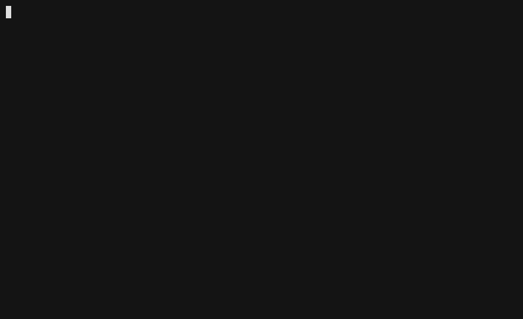

<p align="center">
  <picture>
    <source media="(prefers-color-scheme: dark)" srcset="docs/public/minimal-mark-light.svg">
    
  </picture>
</p>

<h1 align="center">Minimal</h1>

<p align="center"><strong>Dev Environments, Contained</strong><br>Isolated, reproducible development sandboxes and a secure package manager that give your whole team identical environments, while keeping AI agents off the laptop.</p>

<p align="center">
  <a href="https://docs.minimal.dev/">Documentation</a> ·
  <a href="#getting-started">Getting Started</a> ·
  <a href="docs/reference/loadouts.md">Loadouts</a> ·
  <a href="docs/architecture.md">Architecture</a> ·
  <a href="https://github.com/gominimal/minimal/discussions">Discussions</a>
</p>

<p align="center">

[](https://github.com/gominimal/minimal/actions/workflows/ci.yml)
[](LICENSE)
[](https://docs.minimal.dev/)
[](https://discord.com/invite/qgX8sm6X7G)
[](https://www.rust-lang.org/)

</p>

---

## What is Minimal?

Minimal is a declarative, content-addressed build system and development-environment manager. It repeatably builds Linux, terminal-based development sandboxes, each populated with exactly the toolsets and agents a project needs, all declared in a single `minimal.toml` blueprint. A sandbox runs natively on Linux via unprivileged user namespaces and inside a lightweight libkrun microVM on macOS, so the same environment travels across your team's machines. Commit that blueprint to your repository and every teammate gets an identical environment, one that keeps AI agents sealed inside the sandbox and off the host laptop.

The executables inside a sandbox (git, claude-code, compilers, shells, and more) are delivered by Minimal's secure package manager from a curated registry that is refreshed daily. Because packages are addressed by content rather than mutable version tags and builds are hermetic, the same blueprint resolves to the same environment on every machine. Moving the whole team to the freshest tool versions is one `min update`, which re-pins the blueprint in place. No more stale setup wikis, no more version drift.

Per-developer Loadouts then layer each person's own editors, terminal multiplexers, and configs on top of that shared toolchain, so the environment stays identical for everyone while you keep the muscle memory you have earned.

> Full documentation lives at [docs.minimal.dev](https://docs.minimal.dev/).

<p align="center">
  
</p>

## Supported Platforms

Minimal works on:

- macOS on ARM64 (Apple Silicon)
- Ubuntu and Debian Linux on ARM64 and x86_64, with a Linux kernel >= 5.10. Rootless user-namespace creation must be enabled for non-VM usage.

Not on one of these platforms yet? Tell us what you'd like to see supported in [Discussions](https://github.com/gominimal/minimal/discussions). It helps us prioritize.

## Installation

To get started, install Minimal with the following shell command (a stable channel is coming soon):

```shell
curl --proto "=https" --tlsv1.2 -fsSL 'https://go.minimal.dev/unstable' | sh
```

This installs Minimal on your system, adds `min` to your PATH, and sets up shell completions for bash, fish, and zsh.

Minimal can be uninstalled with:

```shell
curl --proto "=https" --tlsv1.2 -fsSL 'https://go.minimal.dev/unstable' | sh -s -- --uninstall
```

## Getting Started

The examples below walk through the two most common workflows: starting a brand-new project inside a sandbox, and joining an existing project that already has a `minimal.toml`.

### Create a new project with Minimal

In this example we'll create a new git repo from within a Minimal sandbox, using tools from the [Minimal Public Registry](https://github.com/gominimal/pkgs/). It assumes Claude Code has been granted access to your GitHub repos (via the Claude GitHub App) so it can push changes on your behalf.

```shell
mkdir -p ~/projects/foo
cd ~/projects/foo

# create a minimal.toml file
min init

# declare your session's tools by editing the scaffolded [session] table in
# minimal.toml; extend its packages list from ["base", "vim"] (don't add a
# second [session] table):
#   [session] # min attach
#   packages = ["base", "vim", "git", "gh", "claude-code"]

# start and enter a sandbox, which copies up the CWD file tree into the sandbox
min activate --attach .

git init

# develop specs, generate & test code, push to git, etc.
# agents can add build/runtime dependencies from the Minimal Public Registry with "min add"
claude

exit
```

Prefer not to install the Claude GitHub App? The next example uses a fine-grained GitHub personal access token (PAT) stored in the macOS keychain instead. To create a fine-grained PAT (e.g. scoped to a specific repo), go to <https://github.com/settings/personal-access-tokens>.

Once you have created the PAT, copied it into your keychain (e.g. `security add-generic-password -s "PAT-foo-repo" -a "my-mac-user-name" -w`), and created the new, empty GitHub repo, the following shows how to populate that repo from within a sandbox:

```shell
mkdir -p ~/projects/foo
cd ~/projects/foo

# create a minimal.toml file
min init

# declare your session's tools by editing the scaffolded [session] table in
# minimal.toml; extend its packages list from ["base", "vim"] (don't add a
# second [session] table):
#   [session] # min attach
#   packages = ["base", "vim", "git", "gh", "claude-code", "mermaid-cli", "kittyview", "less", "emacs"]

# copy the GitHub PAT to your clipboard from your macOS keychain
security find-generic-password -w -s "PAT-foo-repo" -a "my-mac-user-name" | pbcopy

# start and enter a sandbox, which copies up the CWD file tree into the sandbox
min activate --attach .

git init

# develop specs, generate code, etc.
claude --dangerously-skip-permissions

# review the generated code first
git add -A
git commit -m "initial checkin"

# add GH credential after AI Agents are terminated
read -sp "paste GH PAT now:" GH_TOKEN && export GH_TOKEN

# push to github
git remote add origin https://github.com/<your-owner>/<your-repo>.git
git branch -M main
git push -u origin main

exit
```

### Work on an existing project in a Minimal sandbox

In this example we'll work on an existing git repo that already has a `minimal.toml`, where Claude Code has been granted access to our GitHub repos.

```shell
cd ~/projects/foo

# get the latest files on the current branch - we need the minimal.toml
git pull

# don't copy any files up; we'll git pull inside the sandbox
min activate --attach --sync none .

# tell claude to pull https://github.com/<your-owner>/<your-repo>.git
# then add new features, fix bugs, etc.
# then ask claude to create a PR
claude

exit
```

### Add a Minimal Loadout with your preferred tools and configurations

The project's `minimal.toml` describes what every contributor's session
needs; a **loadout** carries what *you* want on top: your editor, terminal
multiplexer, shell config, and dotfiles. Loadouts are single TOML files under
`~/.config/minimal/loadouts/`:

```toml
# ~/.config/minimal/loadouts/dev.toml
name        = "dev"
description = "helix + zellij with my dotfiles"
packages    = ["helix", "zellij"]

[vars]
EDITOR = "hx"
TERM   = { inherit = true, default = "xterm-256color" }
```

Apply one with `min activate --loadout dev --attach .`, or list it in
`default_loadouts` under `[loadouts]` in `~/.config/minimal/config.toml` to have it join every
session automatically. `min loadout list` shows what's available. The full
schema (file patches, lifecycle hooks, environment-variable inheritance,
composition rules) is in the
[loadouts reference](docs/reference/loadouts.md).

## Tech Stack

Sandboxes: a pure Rust client, daemon, and VM manager. The sandbox VM is powered by [libkrun](https://github.com/libkrun/libkrun), a custom Linux kernel image, and an Alpine Linux rootfs.

[Packages](https://github.com/gominimal/pkgs/): glibc-based packages built frequently on Minimal's build servers from their canonical sources (GNU, GitHub, GitLab, etc.).

## Documentation

- [Architecture overview](docs/architecture.md): how the crates fit together
- [CLI reference](docs/reference/cli.md): every `min` command
- [`minimal.toml` reference](docs/reference/minimal-dot-toml.md): the project blueprint format
- [Linux host setup](docs/reference/linux-host-setup.md): kernel and namespace requirements
- More guides live in [docs/](docs/)

## Building and Testing

Minimal is a Cargo workspace, and the `just` recipes are the easiest way to
build and test it: they apply the correct per-OS scope for you. That matters
most on macOS, where the full workspace does not build yet (`minimald`'s
sandbox stack is Linux-only), so the recipes scope to what does.

```shell
just ci      # the full pre-PR gate: fmt, clippy, cargo-deny, tests, doctests
just test    # run the test suite
just clippy  # lint
```

`just --list` shows every recipe (builds, VM bring-up, e2e, and more). On
Linux you can also drive Cargo directly against the whole workspace
(`cargo build`, `cargo test`); on macOS prefer the recipes so you never have
to scope crates by hand. Binaries land at
`target/debug/{min,mip,minimald,minvmd}` (or `target/release/`). Building the
entire package registry is heavy: 8 cores and at least 16 GB of RAM are
recommended. See [AGENTS.md](AGENTS.md#platform-matrix) for the platform
matrix.

### Ubuntu 24.04+ hosts

Sessions run in an unprivileged user namespace, which Ubuntu 24.04 blocks by
default (`kernel.apparmor_restrict_unprivileged_userns=1`), so every session dies
at `uid_map` with `Operation not permitted`. Install the AppArmor profile that
grants `minimald` the `userns` permission:

```shell
$> sudo scripts/install-apparmor-profile.sh              # installed binary
$> sudo scripts/install-apparmor-profile.sh --path "$PWD/target/debug/minimald"   # dev build
```

Installed via `curl … | sh` instead of a checkout? The installer ships this
loader and prints a hint when the host needs it; run
`sudo bash ~/.local/share/minimal/apparmor/install-apparmor-profile.sh`.

See [docs/reference/linux-host-setup.md](docs/reference/linux-host-setup.md).

## Contributing

We'd love your help, and you don't need to be a Rust expert to pitch in: bug reports, docs fixes, and feature ideas are all valued contributions. Please [open an Issue](https://github.com/gominimal/minimal/issues/new/choose) (or start a [Discussion](https://github.com/gominimal/minimal/discussions/new/choose) if it's large in scope) to outline the improvements you're seeking.

If you want to contribute code, docs, etc., please head over to [CONTRIBUTING.md](./CONTRIBUTING.md) for the development workflow and what we look for in a contribution.

### Contributor License Agreement

Before we can merge your first pull request, you'll need to accept our **Individual Contributor License Agreement (ICLA)**. This is a one-time, ~30 second step: [CLA Assistant](https://cla-assistant.io/) will post a link on your PR, you click through, sign in with GitHub, and you're done. You're then covered for all future contributions to this repository.

If you're contributing on your employer's time, or with code your employer might own, your employer will also need a **Corporate CLA (CCLA)** on file listing you as an authorized contributor. See [CONTRIBUTING.md](./CONTRIBUTING.md) for details, or email **security@minimal.dev** if you need help getting one set up.

Full text: [ICLA](./legal/ICLA.md) · [CCLA](./legal/CCLA.md)

## Code of Conduct

We want everyone to feel welcome here, whatever your background or experience level. This project follows the [Contributor Covenant](./CODE_OF_CONDUCT.md); by participating (contributing code, filing issues, or joining discussions) you agree to uphold it.

## Security

If you believe you've found a security vulnerability, please email **security@minimal.dev** instead of opening a public issue. We appreciate responsible disclosure and will get back to you quickly.

## License

This project is licensed under the [Apache License Version 2.0](LICENSE). See the [LICENSE](LICENSE) file for details.
