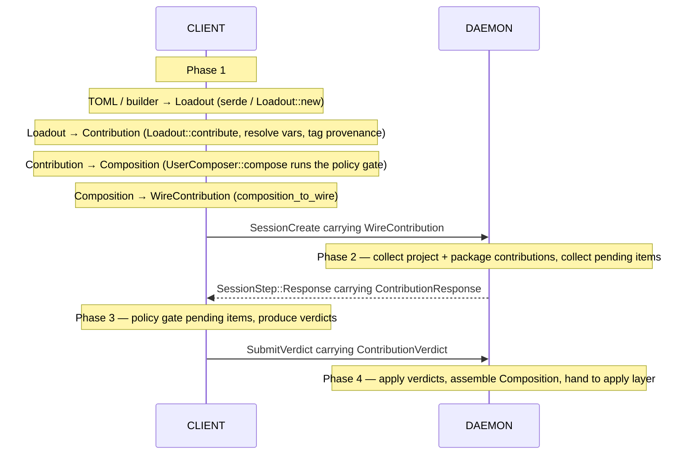
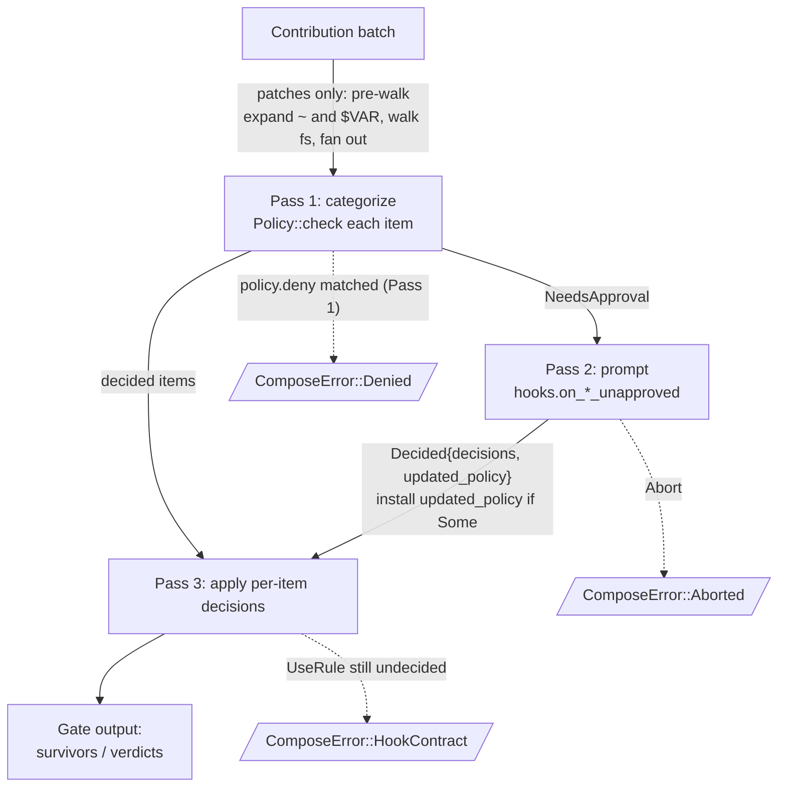

# Session Composition Data Flow

How contributions move from declarative sources to a `Composition`
the apply layer consumes. The pipeline is a **linear, four-phase
sequence** spanning two processes:

1. **Client composes** the user's loadouts.
2. **Daemon collects** project- and package-level contributions
   alongside the client's wire contribution, and emits anything
   that needs user gating.
3. **Client gates** those pending items against the user policy.
4. **Daemon assembles** the final `Composition` and hands it to the
   apply layer.

User policy is enforced **only on the client**. The daemon never
runs user policy; it forwards items needing approval and applies the
verdicts that come back.

## End-to-end flow

Each phase consumes the previous phase's output and produces the
next phase's input. There is no loop: the daemon batches every
pending item into one `ContributionResponse`, and the client
batches every verdict into one `ContributionVerdict`.

> **Status note.** The shared gate pipeline (`compose_contribution`,
> with `gate_vars` + `gate_patches`) exists in `core::compose` and
> drives Phase 1 today via `UserComposer::compose`. Phases 2–4 are
> not yet wired: the daemon doesn't yet emit a `ContributionResponse`
> for unresolved items, and the client doesn't yet have a Phase 3
> handler that runs the gate to produce a `ContributionVerdict`.
> `SessionComposer::compose` is a placeholder until those land. The
> hooks-driven gate code is positioned to run on the client (from the
> Phase 3 handler), not on the daemon.

## Phases in detail

### Phase 1 — Client composes loadouts

The user's loadouts are added to a `UserComposer` via
`UserComposer::add`. Each `Loadout::contribute(env)` call resolves
`VarValue::Inherit*` and tags
items with `Source::UserLoadout`. `UserComposer::compose(policy)`
runs the **shared client-side gate pipeline** (described below).
User-origin items auto-pass the `allow` step but still hit `deny`
and `ignore`, so the gate completes without prompts (every outcome
is decidable). The output is a `WireContribution`, shipped to the
daemon inside a `SessionCreateRequest`.

### Phase 2 — Daemon collects and emits pending items

The daemon receives the `WireContribution` (already gated, trusted
verbatim) and draws items from project- and package-level
`Composable`s into a `Contribution`. Items decidable from the
user's existing policy go straight into the building `Composition`;
items the policy can't decide are collected as
`WirePendingVar`/`WirePendingPatch` and emitted in one
`ContributionResponse`.

### Phase 3 — Client gates the pending items

The client receives the `ContributionResponse` and runs the gate
pipeline over the pending batch: resolves any inherit vars, expands
patch sources, applies the user policy, and prompts via local
`PolicyHooks` when needed. Result: one `ContributionVerdict`,
shipped back to the daemon via `SubmitVerdict`.

### Phase 4 — Daemon assembles and hands off

The daemon applies the verdicts: allowed items enter the
`Composition`, denied items abort the session. The final
`Composition` is handed to the apply layer, which builds the
sandbox, materializes vars, copies patched files, and installs
lifecycle hooks.

`Composition`'s fields: `vars: Vec<SessionVar>`, `patches:
Vec<SessionPatch>`, `packages: Vec<ProvenancedPackage>`,
`lifecycle_hooks: Vec<ProvenancedHook>`. Vars and patches are
policy-gated (so they're wrapped as `Session*`); packages and hooks
pass through unchanged.

## The shared client-side gate pipeline

The same pipeline runs in two distinct phases — once in Phase 1 to
compose loadouts, once in Phase 3 to generate verdicts on the
daemon's pending items. Patches add a filesystem walk up front;
vars don't.

Below, in numbered prose:

1. **Patch pre-walk.** For each `Patch`, expand `~` and `$VAR` in the
   source pattern (using the already-gated vars from earlier in the
   batch plus the composer's `HOME` env lookup as tilde fallback).
   Walk the filesystem under each expanded root and fan out to one
   `PatchFile` per matching file. Expand `~` and `$VAR` in
   `PatchPolicy` patterns the same way, against a temporary copy
   (the raw policy is preserved for round-trip).
2. **Pass 1 — Categorize.** Each item runs through `Policy::check`,
   which steps through:
   - `ignore` matches? → `Ignored`; drop silently.
   - `deny` matches? → `Denied`; surface `ComposeError::Denied`
     regardless of origin.
   - `Source::UserLoadout`? → `Allowed` (auto-pass the allow step;
     the user doesn't need to allow-list their own loadout).
   - `allow` matches? → `Allowed`; push.
   - Otherwise → `NeedsApproval`; defer to Pass 2.
3. **Pass 2 — Prompt.** Call `hooks.on_*_unapproved(policy_copy,
   &[Unapproved])`. The hook returns either `Abort` (→
   `ComposeError::Aborted`) or `Decided { decisions, updated_policy
   }`. If `updated_policy` is `Some`, install it for the re-checks
   in Pass 3. There is no per-item deny: denial terminates the whole
   composition, which is what `Abort` already does, so to reject a
   single item the hook returns `Abort`.
4. **Pass 3 — Apply.** Per-item decisions:
   - `AllowOnce` → push.
   - `UseRule` → re-run `Policy::check` against the (possibly
     updated) policy; act on the new outcome. If the policy *still*
     can't decide, surface `ComposeError::HookContract` — the
     application lied.

In Phase 1 (user loadouts only) every item is either auto-allowed,
ignored, or denied at Pass 1 — Pass 2 is never invoked. In Phase 3
the items are project/package origin, so the auto-allow doesn't
apply and Pass 2 is the normal path for anything not in `allow`
or `deny`.

## Vocabulary

Three operations are deliberately distinguished so the names don't
overload:

- **Resolve** — turn a deferred reference into a concrete value.
  `ResolvedVar::resolve_with` does this for `VarValue::Inherit*`;
  patch source expansion does it for `$VAR` and `~` inside patterns.
- **Gate** — apply the `UserPolicy` (allow/deny/ignore + hooks).
  `gate_vars` and `gate_patches` are the per-domain gates.
- **Compose** — the top-level pipeline that accumulates
  contributions and drives the gates. Each composer's `compose`
  method.

`ResolvedVar`, `ResolvedPatch`, `ResolvedVar::resolve_with` use
"resolve" narrowly. `Composition`, `ComposeError`, `ComposeOptions`,
`compose_contribution` describe the pipeline.

## Key invariants

- **User policy lives on the client.** The daemon never runs user
  policy. Phase 3 happens on the client: it gates the items the
  daemon couldn't auto-decide and emits verdicts. Phase 4 on the
  daemon applies those verdicts without re-checking them.
- **Composers accumulate; compose decides.** Per phase, all
  contribution happens first; the gate pipeline runs over the
  accumulated `Contribution`. Phases 2 and 3 are linked by exactly
  one message each direction — `ContributionResponse` out,
  `ContributionVerdict` in — never more.
- **`Composable::contribute` is the only entry point.** Contributors
  produce a `Contribution`; composers absorb it via
  `Contribution::merge`. There is no public way to push raw
  primitives — every item must carry a known `Source`.
- **Env lookup lives on the composer.** Both composers default to
  `std::env::var`; `with_env(...)` pins a custom closure for tests.
  Each `add` threads the lookup into `contribute`. The patch gate
  reads `HOME` via the same closure as tilde fallback.
- **Source travels end-to-end.** Every primitive carries its `Source`
  through every gate and into the final `Composition`, so downstream
  layers (audit, inspection commands, error reporting) can attribute
  every surviving item to its contributor.
- **Vars and patches are policy-gated; packages and hooks are not.**
  Package selection happens downstream in the graph layer; lifecycle
  hooks execute inside the sandbox. Neither needs an
  `allow`/`deny`/`ignore` gate.
- **User-origin items auto-pass `allow`; `deny` and `ignore` still
  apply.** The user doesn't need to allow-list their own loadout
  entries — Pass 1 treats `Source::UserLoadout` as a free pass on
  the allow step — but a deny rule still rejects them and an
  ignore rule still drops them. As a consequence, the client's
  initial composition never needs to prompt (every outcome is
  decidable: ignored, denied, or auto-allowed).
- **Patches fan out before policy check.** A single `Patch` with a
  glob source becomes N `PatchFile`s; each is checked independently.
  A `Denied` on any one file kills the whole composition.
- **Hook gets narrow policy by value.** The gate hands the hook an
  owned `VarsPolicy` or `PatchPolicy` — never `&mut UserPolicy`. To
  add a rule, the hook returns the modified copy in
  `HookResult::Decided.updated_policy`; the gate installs it before
  Pass 3.
- **Wire items submitted from the client are trusted on the daemon
  side.** The Phase 1 `WireContribution` and the Phase 3
  `ContributionVerdict` both carry decisions the user has already
  made. The daemon doesn't re-gate them.
- **Source `~` is expanded at gate time; dest has no `~` to expand.**
  Patch source `FileSet` patterns and `PatchPolicy` patterns expand
  `~` against a resolved `HOME` — loadout-declared session var first,
  else the composer's `env("HOME")`. `PatchDest` is always relative
  to the sandbox user's home; `~` and absolute paths are rejected at
  construction. Patterns retain their `~` form in returned policies,
  so save/load is lossless.
- **`Contribution::merge` is pure aggregation today.** Two
  contributors pushing the same var name both survive into the
  `Composition`. Conflict resolution (precedence, dedup,
  error-on-conflict) will live in this one internal method when it
  lands; the merge site is intentionally one place.
- **Internal invariants panic, not error.** `compute_dest` panics on
  precondition violation. These are bug signals, not recoverable.
- **Terminating failure modes:** `Denied` (explicit policy reject),
  `Aborted` (hook returned `Abort`), `HookContract` (application
  bug — wrong decision count, or `UseRule` to a still-undecidable
  item), `PatchWalk` (IO-level filesystem walk failures),
  `Expansion` (malformed `$VAR` / `~` pattern, or undefined var).
