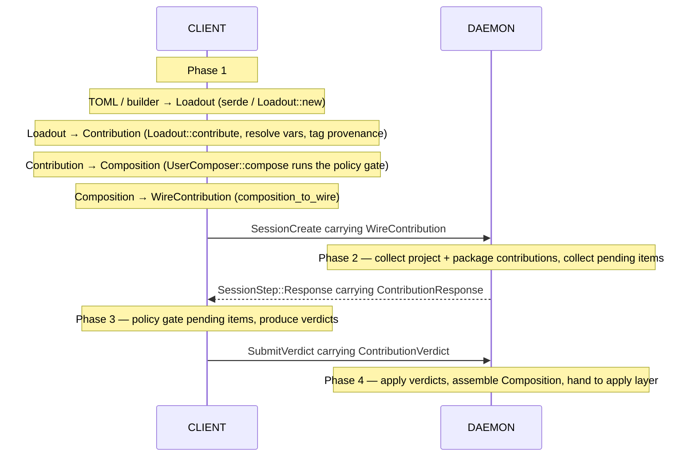
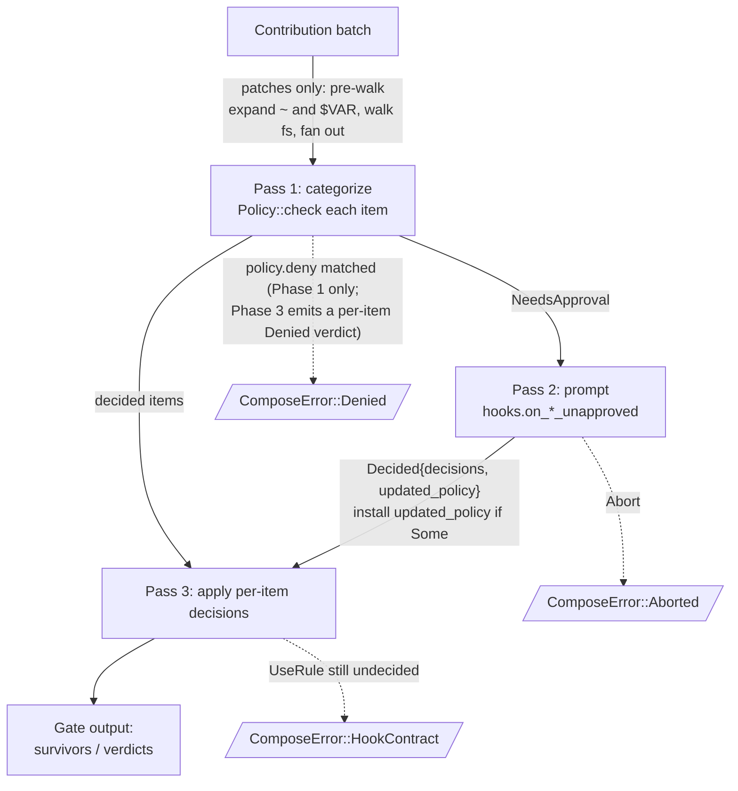

# Session Composition Data Flow

How contributions move from declarative sources to a `Composition`
the apply layer consumes. The pipeline is a **linear, four-phase
sequence** spanning two processes:

1. **Client composes** the user's loadouts.
2. **Daemon collects** project- and package-level contributions
   alongside the client's wire contribution, and emits anything
   that needs user gating.
3. **Client gates** those pending items against the user policy.
4. **Daemon assembles** the final `Composition` and hands it to the
   apply layer.

User policy is enforced **only on the client**. The daemon never
runs user policy; it forwards items needing approval and applies the
verdicts that come back.

## End-to-end flow

Each phase consumes the previous phase's output and produces the
next phase's input. There is no loop: the daemon batches every
pending item into one `ContributionResponse`, and the client
batches every verdict into one `ContributionVerdict`.

> **Status note.** The shared gate pipeline (`compose_contribution`,
> with `gate_vars` + `gate_patches`) lives in `core::compose`. Phase
> 1 runs it via `UserComposer::compose` and Phase 3 runs it via
> `client::handler::handle_response`. Phase 2 (daemon-side routing)
> lives in `SessionComposer::compose` and produces a
> `ComposeOutcome::Ready` or `ComposeOutcome::Pending`. Phase 4 is
> partially wired — the `Ready` outcome is consumed (the manager
> persists the session and returns `CreateSessionResponse::Ready`),
> but `Pending` outcomes are still rejected with `InvalidInput`
> because the `SubmitVerdict` handler hasn't landed yet. No daemon-
> side project/package contributors are wired in either, so every
> caller still hits the all-decided path today.

## Phases in detail

### Phase 1 — Client composes loadouts

The user's loadouts are added to a `UserComposer` via
`UserComposer::add`. Each `Loadout::contribute(env)` call resolves
`VarValue::Inherit*` and tags
items with `Source::UserLoadout`. `UserComposer::compose(policy)`
runs the **shared client-side gate pipeline** (described below).
User-origin items auto-pass the `allow` step but still hit `deny`
and `ignore`, so the gate completes without prompts (every outcome
is decidable). The output is a `WireContribution`, shipped to the
daemon inside `minimald_rpc::CreateSessionRequest { config,
contribution }`. The `config` half carries the out-of-band session
fields (`name`, `project_path`, `network`, `policy`, `attrs`);
internal callers that don't go through the composition pipeline
(sftp, exec, session-recovery) supply `WireContribution::default()`
for the contribution half and the daemon takes the empty-
contribution fast path described in Phase 4.

### Phase 2 — Daemon collects and emits pending items

The daemon receives the `WireContribution` (already gated, trusted
verbatim) and draws items from project- and package-level
`Composable`s into a `Contribution` via `SessionComposer::add`.
`SessionComposer::compose` then drives the routing:

- **All-decided fast path.** If the daemon collected no vars and
  no patches (today's only path — no project/package contributors
  are wired into the manager yet), the composer assembles a
  `Composition` directly: daemon-collected packages and lifecycle
  hooks pass through (neither has a per-item verdict slot in the
  wire schema), and the client's already-gated wire contribution
  is merged in via `Composition::extend_from_wire`. Returns
  `ComposeOutcome::Ready(composition)`.
- **Pending path.** If the daemon collected any vars or patches,
  the composer routes every one of them back to the client as
  pending items —
  the daemon never runs user policy, so no daemon-origin item is
  ever auto-decided. The pending items + the daemon-collected
  packages and lifecycle hooks (which have no per-item verdict
  slot) ride in a `ContributionResponse`; the daemon also retains
  a `PendingComposeState` so Phase 4 can finalize after the
  verdict comes back.

### Phase 3 — Client gates the pending items

The client receives the `ContributionResponse` and runs
`client::handler::handle_response` over the pending batch: resolves
any `Inherit`/`InheritWithDefault` vars against the client env
(`ResolvedVar::resolve_with`), expands patch sources against the
already-gated vars from Phase 1 plus anything approved in this
batch, applies the user policy, and prompts via local `PolicyHooks`
when the policy can't decide. Result: one `ContributionVerdict`,
shipped back to the daemon via `SubmitVerdict`. Lifecycle hooks in
the response are dropped — there's no per-hook policy, so the
verdict schema has no slot for them; the daemon installs them as
declared.

**Verdict ordering.** Per-domain verdicts are not in pending-item
order: items the policy auto-decides are emitted in input order,
items routed through the hook land at the end. The daemon must
correlate by `id`, not slice position.

### Phase 4 — Daemon assembles and hands off

The daemon applies the verdicts: allowed items enter the
`Composition`, denied items abort the session. The client's
already-gated wire contribution is then merged in via
`Composition::extend_from_wire`, which runs the same conflict
checks as `Contribution::merge` (see the merge invariant
below) — a cross-process disagreement (e.g. the daemon's
package set declares `EDITOR=hx` and the client's loadout
declares `EDITOR=vim`) surfaces here as
`ComposeError::Conflict`. The final `Composition` is handed to
the apply layer, which builds the sandbox, materializes vars,
copies patched files, and installs lifecycle hooks.

**Response shape.** The daemon returns
`CreateSessionResponse::Ready { id }` when no items need user
gating (today's only path, including the empty-contribution fast
path used by internal callers) or
`CreateSessionResponse::Pending { id, response }` when items need
user-side gating. The `id` is allocated before the response
returns, so file uploads (when that subsystem lands) can target
the session as soon as the client receives either variant. Today
only `Ready` is reachable; `Pending` is wire-defined for the
daemon-side Phase 2 routing that will land in a future change.

**Empty-contribution fast path.** When the client sends
`WireContribution::default()` the daemon skips Phase 2 entirely:
no project/package contributions are collected, no pending items
are emitted, no `Composition::extend_from_wire` merge runs. The
record is persisted as `Active` and returned via `Ready` in one
round-trip. This is the only path exercised by internal callers
today (sftp, exec, session-recovery).

`Composition`'s fields: `vars: Vec<SessionVar>`, `patches:
Vec<SessionPatch>`, `packages: Vec<ProvenancedPackage>`,
`lifecycle_hooks: Vec<ProvenancedHook>`. Vars and patches are
policy-gated (so they're wrapped as `Session*`); packages and hooks
pass through unchanged.

## The shared client-side gate pipeline

The two phases share `Policy::check`, the hook prompt protocol, and
the `UseRule` re-check. They differ in what happens once an item is
`Decided`: Phase 1 (`gate_vars`/`gate_patches` in `core::compose`)
treats `Denied` as fatal and silently drops `Ignored`; Phase 3
(`gate_pending_vars`/`gate_pending_patches` in `client::handler`)
emits a per-item `WireVarVerdict`/`WirePatchVerdict` for every
outcome — the wire schema requires one verdict per pending id.
Patches add a filesystem walk up front; vars don't.

Below, in numbered prose:

1. **Patch pre-walk.** For each `Patch`, expand `~` and `$VAR` in the
   source pattern (using the already-gated vars from earlier in the
   batch plus the composer's `HOME` env lookup as tilde fallback).
   Walk the filesystem under each expanded root and fan out to one
   `PatchFile` per matching file. Expand `~` and `$VAR` in
   `PatchPolicy` patterns the same way, against a temporary copy
   (the raw policy is preserved for round-trip).
2. **Pass 1 — Categorize.** Each item runs through `Policy::check`,
   which steps through:
   - `ignore` matches? → `Ignored`. Phase 1 drops silently;
     Phase 3 emits an `Ignored` verdict.
   - `deny` matches? → `Denied`, regardless of origin. Phase 1
     surfaces `ComposeError::Denied`; Phase 3 emits a `Denied`
     verdict.
   - `Source::UserLoadout`? → `Allowed` (auto-pass the allow step;
     the user doesn't need to allow-list their own loadout).
   - `allow` matches? → `Allowed`. Phase 1 pushes; Phase 3 emits
     an `Approved` verdict and adds the var to the in-batch
     expansion context.
   - Otherwise → `NeedsApproval`; defer to Pass 2.
3. **Pass 2 — Prompt.** Call `hooks.on_*_unapproved(policy_copy,
   &[Unapproved])`. The hook returns either `Abort` (→
   `ComposeError::Aborted`) or `Decided { decisions, updated_policy
   }`. If `updated_policy` is `Some`, install it for the re-checks
   in Pass 3. There is no per-item deny: denial terminates the whole
   composition, which is what `Abort` already does, so to reject a
   single item the hook returns `Abort`.
4. **Pass 3 — Apply.** Per-item decisions:
   - `AllowOnce` → push.
   - `UseRule` → re-run `Policy::check` against the (possibly
     updated) policy; act on the new outcome. If the policy *still*
     can't decide, surface `ComposeError::HookContract` — the
     application lied.

In Phase 1 (user loadouts only) every item is either auto-allowed,
ignored, or denied at Pass 1 — Pass 2 is never invoked. In Phase 3
the items are project/package origin, so the auto-allow doesn't
apply and Pass 2 is the normal path for anything not in `allow`
or `deny`.

## Vocabulary

Three operations are deliberately distinguished so the names don't
overload:

- **Resolve** — turn a deferred reference into a concrete value.
  `ResolvedVar::resolve_with` does this for `VarValue::Inherit*`;
  patch source expansion does it for `$VAR` and `~` inside patterns.
- **Gate** — apply the `UserPolicy` (allow/deny/ignore + hooks).
  `gate_vars` and `gate_patches` are the per-domain gates.
- **Compose** — the top-level pipeline that accumulates
  contributions and drives the gates. Each composer's `compose`
  method.

`ResolvedVar`, `ResolvedPatch`, `ResolvedVar::resolve_with` use
"resolve" narrowly. `Composition`, `ComposeError`, `ComposeOptions`,
`compose_contribution` describe the pipeline.

## Key invariants

- **User policy lives on the client.** The daemon never runs user
  policy. Phase 3 happens on the client: it gates the items the
  daemon couldn't auto-decide and emits verdicts. Phase 4 on the
  daemon applies those verdicts without re-checking them.
- **Composers accumulate; compose decides.** Per phase, all
  contribution happens first; the gate pipeline runs over the
  accumulated `Contribution`. Phases 2 and 3 are linked by exactly
  one message each direction — `ContributionResponse` out,
  `ContributionVerdict` in — never more.
- **`Composable::contribute` is the only entry point.** Contributors
  produce a `Contribution`; composers absorb it via
  `Contribution::merge`. There is no public way to push raw
  primitives — every item must carry a known `Source`.
- **Env lookup lives on the composer.** Both composers default to
  `std::env::var` for the `contribute()` step and accept
  `with_env(...)` to pin a custom closure for tests. The
  difference is in patch-source `~` expansion: `UserComposer`
  passes its `env("HOME")` as the tilde fallback, but
  `SessionComposer` passes `None` — daemon-side `~/...` patterns
  must resolve against a `HOME` carried in the client's wire
  vars, never against the daemon's process env. Phase 3's
  `handle_response` reads `HOME` from the client env it was given.
- **Source travels end-to-end.** Every primitive carries its `Source`
  through every gate and into the final `Composition`, so downstream
  layers (audit, inspection commands, error reporting) can attribute
  every surviving item to its contributor.
- **Vars and patches are policy-gated; packages and hooks are not.**
  Package selection happens downstream in the graph layer; lifecycle
  hooks execute inside the sandbox. Neither needs an
  `allow`/`deny`/`ignore` gate.
- **User-origin items auto-pass `allow`; `deny` and `ignore` still
  apply.** The user doesn't need to allow-list their own loadout
  entries — Pass 1 treats `Source::UserLoadout` as a free pass on
  the allow step — but a deny rule still rejects them and an
  ignore rule still drops them. As a consequence, the client's
  initial composition never needs to prompt (every outcome is
  decidable: ignored, denied, or auto-allowed).
- **Patches fan out before policy check.** A single `Patch` with a
  glob source becomes N `PatchFile`s; each is checked independently.
  In Phase 1 a `Denied` on any one file aborts the composition;
  in Phase 3 each file gets its own `WirePatchVerdict` so a Denied
  doesn't abort, it just rejects that file.
- **Hook gets narrow policy by value.** The gate hands the hook an
  owned `VarsPolicy` or `PatchPolicy` — never `&mut UserPolicy`. To
  add a rule, the hook returns the modified copy in
  `HookResult::Decided.updated_policy`; the gate installs it before
  Pass 3.
- **Wire items submitted from the client are trusted on the daemon
  side.** The Phase 1 `WireContribution` and the Phase 3
  `ContributionVerdict` both carry decisions the user has already
  made. The daemon doesn't re-gate them.
- **Source `~` is expanded at gate time; dest has no `~` to expand.**
  Patch source `FileSet` patterns and `PatchPolicy` patterns expand
  `~` against a resolved `HOME` — a session var named `HOME` first,
  else the client-side fallback (`UserComposer`'s `env("HOME")` in
  Phase 1, `handle_response`'s `env("HOME")` in Phase 3). The
  `SessionComposer` (Phase 2/4 daemon side) has no fallback —
  daemon `~/...` patterns must resolve from the client's wire vars.
  `PatchDest` is always relative to the sandbox user's home; `~`
  and absolute paths are rejected at construction. Patterns retain
  their `~` form in returned policies, so save/load is lossless.
- **Conflict detection is post-gate.** Per-domain rules:
  - **Vars**: same name + same resolved value → both kept (no
    conflict); same name + different values → `Conflict::VarValueMismatch`.
  - **Patches**: same destination + same source → both kept;
    same destination + different sources → `Conflict::PatchSourceMismatch`.
  - **Packages**: deduplicated by name (set semantics, no value
    to disagree on).
  - **Lifecycle hooks**: concatenated unconditionally (hooks are
    code that runs; two identical scripts run twice).

  Checks run *after* the policy gate has filtered each side —
  inside `compose_contribution` on the survivors of
  `gate_vars`/`gate_patches`, and inside
  `Composition::extend_from_wire` on the chained union of the
  already-gated daemon side and the already-gated wire payload.
  `Contribution::merge` is pure aggregation; running checks there
  would fire before `ignore` could take effect.

  Conflicts are fatal today. The user mitigates by adding the
  conflicting var name to their policy's `ignore` list (or, for
  patches, a pattern matching the conflicting source paths) —
  matched items are dropped during the gate, so the post-gate
  check has nothing to compare. Interactive resolution (replace
  fatal-on-conflict with a hook the user can answer) is not
  implemented; the `Result`-returning merge shape is the place it
  would land.
- **Internal invariants panic, not error.** `compute_dest` panics on
  precondition violation. These are bug signals, not recoverable.
- **Terminating failure modes:** `Denied` (explicit policy reject),
  `Aborted` (hook returned `Abort`), `Conflict` (two contributors
  disagree on a var value or patch source — see the post-gate
  detection invariant above; surfaces as `ComposeError::Conflict`
  from both `compose_contribution` and the cross-process daemon
  merge in `Composition::extend_from_wire`), `HookContract`
  (application bug —
  wrong decision count, or `UseRule` to a still-undecidable
  item), `HookRequired` (non-user-origin item reached a
  legacy `core::compose` path with no hook to prompt — Phase 2
  now routes such items through `SessionComposer::compose`
  instead; this remains for the per-side
  `compose_contribution` codepath), `PatchWalk` (IO-level
  filesystem walk failures),
  `Expansion` (malformed `$VAR` / `~` pattern, or undefined var),
  `VarResolution` (a Phase 3 pending `Inherit` var couldn't be
  resolved against the client env), `InvalidPendingPatchDest` (a
  Phase 3 pending patch destination violates `PatchDest`
  invariants), `InvalidWireItem` (a wire-form item failed
  conversion back to its domain type).
