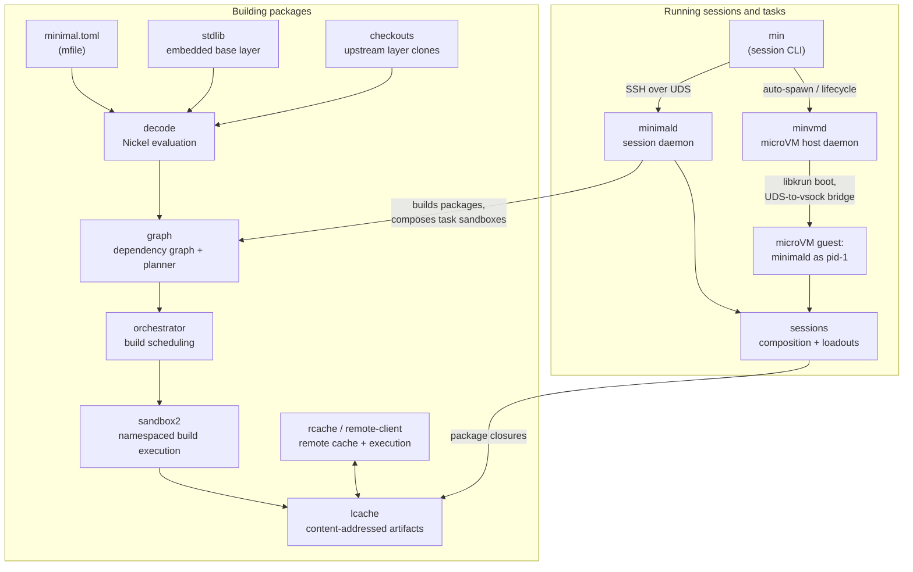

# Architecture Overview

This codebase is the core of **Minimal**: a declarative package manager (similar to Nix),
execution engine, and developer environment.

## 0. Core internals and the product surface

The crates fall into two groups:

- **Core crates** power the deep internals, most of the library crates.
  Declarative evaluation (`mfile`, `decode`, `checkouts`, `stdlib`), the
  dependency graph and build machinery (`graph`, `orchestrator`, `sandbox2`,
  `lcache`, `rcache`, `op`), and the session/composition primitives
  (`sessions`, `switch`). They expose no stable external interface; they exist
  to be wired together.
- **Product-surface crates**: typically the binaries, give users a stable
  interface: `mip` (the package/build CLI), `min` (the session CLI), `minimald`
  (the session daemon), and `minvmd` (the microVM host daemon).

What that surface exposes is two things: **running sessions and tasks** and
**building packages**. The rest of this document walks through each, then maps
every crate.

Where the two meet: `minimald` embeds the build machinery (via `mctx`) to build
or fetch any package a session or task needs, and task sandboxes are composed
from the same cached artifacts a build produces.

## 1. Running sessions and tasks

Sessions are isolated developer environments. The vernacular: the
isolation environment is a **session**; the daemon that creates and hosts
sessions is a **provider**.

### Control path: min → minimald → minvmd

- **min** (the `minimal` crate) is the session CLI. It discovers provider
  sockets, auto-spawns a provider when none is running, and speaks SSH to
  `minimald` over a UNIX domain socket.
- **minimald** is the session daemon: an SSH server that hosts sessions and
  task/sandbox executions within them. On Linux it runs natively on the host.
  Oneshot RPCs (create session, list, exec, sftp, …) share a wire contract
  defined in the **minimald-rpc** crate.
- **minvmd** is the microVM host daemon for platforms (macOS) or setups where
  `minimald` cannot run natively: it boots a Linux microVM via libkrun
  (Hypervisor.framework on macOS, KVM on Linux), supervises its lifecycle, and
  bridges a host UNIX socket to a vsock port inside the VM so `min` reaches
  the in-VM `minimald` without knowing a VM exists. See
  [spec 01 (host daemon)](https://github.com/gominimal/minimal/blob/main/docs/specs/01-spec-minvmd-host-daemon/01-spec-minvmd-host-daemon.md)
  and
  [spec 02 (Linux KVM backend)](https://github.com/gominimal/minimal/blob/main/docs/specs/02-spec-minvmd-linux-kvm/02-spec-minvmd-linux-kvm.md).

### Session composition

Creating a session runs a linear, four-phase composition pipeline spanning the
client and the daemon: the client composes the user's loadouts and gates them
against user policy; the daemon collects project- and package-level
contributions and routes anything needing approval back to the client; the
client gates those pending items and returns verdicts; the daemon assembles the
final `Composition` (vars, file patches, packages, lifecycle hooks) for the
apply layer. User policy is enforced only on the client; the daemon never runs
it. The **sessions** crate holds these primitives; the full data flow is
documented in [Sessions composition](internal/sessions-composition.md) (source: `crates/sessions/docs/COMPOSITION.md`).

### VM internals

The guest boots from three artifacts: an uncompressed kernel image, a generic
ext4 rootfs loaded as a block device, and an initramfs whose `/init` is a
static cross-compiled `minimald` binary. `minimald` runs as guest pid-1: it
mounts the rootfs and pseudo-filesystems, `chroot`s in, then writes a `READY`
beacon over vsock. `minvmd` registers the host UDS↔vsock bridge and `minimald`
serves SSH directly on that vsock port, so the CLI's connection reaches the
session with no in-guest relay. Details and local boot instructions:
[minvmd internals](internal/minvmd.md) (source: `crates/minvmd/README.md`). The ready beacon also
carries the guest's SSH host public key
([spec 06](https://github.com/gominimal/minimal/blob/main/docs/specs/06-spec-ssh-host-key-in-beacon/06-spec-ssh-host-key-in-beacon.md)).

### Networking

Session networking is built on **gvproxy** (gvisor-tap-vsock): one gvproxy per
host acts as a userspace virtual switch serving VMs and own-IP sandboxes as
switch clients, with no root privilege required. Sessions choose a network
mode: no-net, host-net, or own-IP (a dedicated IP on the virtual subnet),
with DNS naming, egress policy, and ingress port-mapping layered on top. The
**switch** crate holds the shared primitives (subnet arithmetic, MAC
derivation, vsock wire constants, gvproxy config rendering) used by both
`minimald` and `minvmd`. See
[spec 03 (networking)](https://github.com/gominimal/minimal/blob/main/docs/specs/03-spec-networking/03-spec-networking.md)
and
[spec 05 (gvproxy supervision via pidfd)](https://github.com/gominimal/minimal/blob/main/docs/specs/05-spec-minvmd-gvproxy-pidfd/05-spec-minvmd-gvproxy-pidfd.md).

### Persistence

Each VM owns a writable ext4 volume that backs the guest's package cache,
sandbox staging trees, and session state. Cache and staging must share one
filesystem (hardlink composition cannot cross devices), and the volume gives
sessions and cached artifacts a life beyond a single VM boot. See
[spec 08 (per-VM ext4 volume)](https://github.com/gominimal/minimal/blob/main/docs/specs/08-spec-vm-ext4-volume/08-spec-vm-ext4-volume.md).

### Remote cache

Built artifacts can be fetched from (and uploaded to) a remote cache so
machines share build results:

- **rcache**: remote cache implementation, fetching/uploading build artifacts
  over the network.
- **remote-proto**: protobuf wire types for the Remote Execution Service (RES).
- **remote-client**: client that drives the Remote Execution Service against
  the local graph.

## 2. Building packages

Where possible, different features live in different crates to maximize
modularity and parallelize compile time as much as possible.

Notable crates, in roughly the order the build pipeline drives them:

| Crate | Role |
|---|---|
| `mfile` | Finds and parses `minimal.toml`, the entry-point of a project's minimal configuration. |
| `decode` | Parses a `Layer` of declarative config (typically a codebase of Nickel files) into an in-memory representation. |
| `stdlib` | The embedded Minimal standard library, the base layer of Nickel code every evaluation builds on. |
| `checkouts` | Maintains git checkouts of upstream layer repositories at pinned versions, so `decode` can evaluate the full layer chain. |
| `graph` | The in-memory dependency graph of packages, built from decode's objects; its `planner` module computes build orderings. |
| `lcache` | Manages the local cache of built artifacts, content-addressed and keyed by blake3 hash. |
| `mctx` | Provides a 'minimal context': a higher-level API bringing the main features together. Both CLIs and `minimald` drive the build machinery through it. |
| `op` | Complex operations over the graph or packages, anything complex enough to warrant its own place/process-name. |
| `orchestrator` | Owns runtime orchestration of package builds. |
| `sandbox2` | Sandboxed build/task execution API using Linux namespaces. |
| `check` | Lints Minimal configuration: `minimal.toml`, packages, profiles, and stacks. |
| `mip` | The package/build CLI entry-point. |

### Overall operation

1. The relevant `minimal.toml`/`.minimal/minimal.toml` file is read. If it is
   not in the current directory, the search walks **up** the directory tree
   toward the filesystem root until one is found.
2. Declarative packages are read: the _decode_ crate is invoked to evaluate
   nickel files into in-memory structures. The `minimal.toml` file typically
   defines an upstream repo it is based on (materialized locally by the
   _checkouts_ crate), so this process is done recursively to get the full
   chain, with the embedded _stdlib_ as the base layer.
3. These decoded structures are loaded into a single in-memory representation,
   the dependency graph (`graph` crate).
4. From here, the next steps depend on what is being called for by the
   user/API, typically through `mctx`, which owns the wiring from
   configuration discovery through decoding, graph construction, and cache
   lookup.

### Build ordering and execution

1. When a set of packages are needed (we call this the "top level"), we compute
   the transitive dependencies (that is, all the packages' runtime dependencies
   and all those packages' runtime dependencies, and so on).
2. Based on that set, we compute an ordered sequence of builds to build each
   package, such that at the moment of build each package has all its
   build/runtime dependencies (and transitive dependencies) satisfied. This is
   implemented in the `planner` module of the `graph` crate.
3. This plan is used to set up an impl of `orchestrator::Backend` which will
   actually do the builds in the correct order, kicking off further builds as
   dictated by the plan as soon as dependencies are satisfied.
4. When a package build is complete, the files collected from the build are
   committed to the local cache. The key for a package's files (the 'build
   artifacts') is a hash of the declaration of that package, including the
   build steps and all its dependencies, and all their dependencies, and so on
   (like derivation hashes in Nix).

## 3. Crate map

| Crate | Area | Role |
|---|---|---|
| `args` | build | Types for the argument schema of tasks and sideload parameters. |
| `async-dialog` | session | Interactive terminal prompts over any async reader/writer (no TTY required). |
| `check` | build | `mip check` linting of `minimal.toml`, packages, profiles, and stacks. |
| `checkouts` | build | Git repository checkout management for source operations (upstream layers at pinned versions). |
| `common` | shared | Common types and utilities (e.g. `SpecHash`) used across the codebase. |
| `decode` | build | Evaluates a Nickel config layer into in-memory packages/profiles/stacks. |
| `diagnostics` | shared | App-agnostic machinery for diagnostic support bundles. |
| `graph` | build | The in-memory, semantic dependency graph; the `planner` module orders builds. |
| `lcache` | build | Local cache of built artifacts, keyed by `SpecHash`. |
| `mctx` | shared | Top-level 'minimal context' API tying configuration, decoding, graph, and cache together. |
| `mfile` | build | Finding and reading the `minimal.toml` file. |
| `minimal` | session | The `min` session CLI, which pairs with and talks to `minimald`. |
| `minimald` | session | The session daemon: an SSH server hosting sessions and task/sandbox executions. |
| `minimald-rpc` | session | Wire contract for `minimald`'s oneshot SSH RPCs. |
| `minvmd` | session | Host daemon that boots Linux microVMs via libkrun and bridges host UDS to in-VM vsock. |
| `mip` | build | The Minimal package/build CLI. |
| `op` | build | Complex operations over the graph and packages (builds, cache object construction). |
| `orchestrator` | build | Runtime orchestration of builds behind a pluggable `Backend`. |
| `ot` | shared | Operation tracking for progress rendering (render-agnostic core + drivers). |
| `paths` | shared | Realm-tagged path types distinguishing host, sandbox, and daemon filesystems. |
| `rcache` | build | Remote cache: fetch/upload build artifacts over the network. |
| `remote-client` | build | Client for the Remote Execution Service, driving remote builds against the graph. |
| `remote-proto` | build | Protobuf / wire types for the Remote Execution Service (RES). |
| `sandbox2` | build | The low-level sandbox implementation (Linux user + mount namespaces). |
| `sessions` | session | Session primitives: lifecycle hooks, loadouts, and the composition pipeline. |
| `stdlib` | build | The embedded Minimal standard library. |
| `switch` | session | gvproxy-switch primitives: subnet arithmetic, MAC derivation, vsock constants, config rendering. |
| `version` | shared | Shared build-time version identity for `min`, `mip`, `minimald`, and `minvmd`. |

## 4. Cache & hashing

**Cache System**:
- **Content-addressed**: Uses Blake3 hash of complete build specification
- **Deterministic**: Same inputs always produce same cache key
- **Persistent**: Located at `~/.cache/minimal/built/` by default
- **Hierarchical**: Organized by hash prefix for filesystem performance

**Sandbox Isolation Strategy**:
- **Linux**: User namespaces + mount namespaces for filesystem isolation
- **File mounting**: Package files hardlinked into a rootfs, which is mounted in the sandbox read-only
- **Input copying**: Source files and local inputs copied to TMPDIR
- **Output staging**: Builds write to `OUTPUT_DIR`, enumerated outputs copied to cache

**Spec Hashing**:
- Complete build specification (including transitive dependencies) hashed with Blake3
- Cache keys are deterministic and include all inputs that affect build output
- Local file inputs include file content hash to detect changes

**TMPDIR Management**:
- Build scripts receive `OUTPUT_DIR` environment variable pointing to staging area
- Only enumerated outputs are copied from staging to cache

### Cache Inspection
- Cache entries are content-addressed by Blake3 hash of complete build spec
- Use `find ~/.cache/minimal/built -name "*pattern*"` to locate specific builds
- Each cache entry contains the complete build output directory tree

## 5. Platform matrix

| Platform | What builds and runs |
|---|---|
| Linux amd64 / arm64 | Full workspace: `min`, `mip`, `minimald`, `minvmd` |
| macOS arm64 | Session stack only: `min`, `minvmd` (`minimald` does not build on macOS; sessions run in a microVM) |

The authoritative development-environment matrix is maintained in AGENTS.md.
