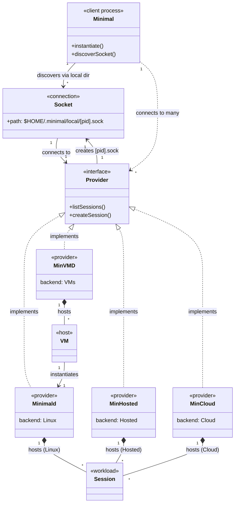
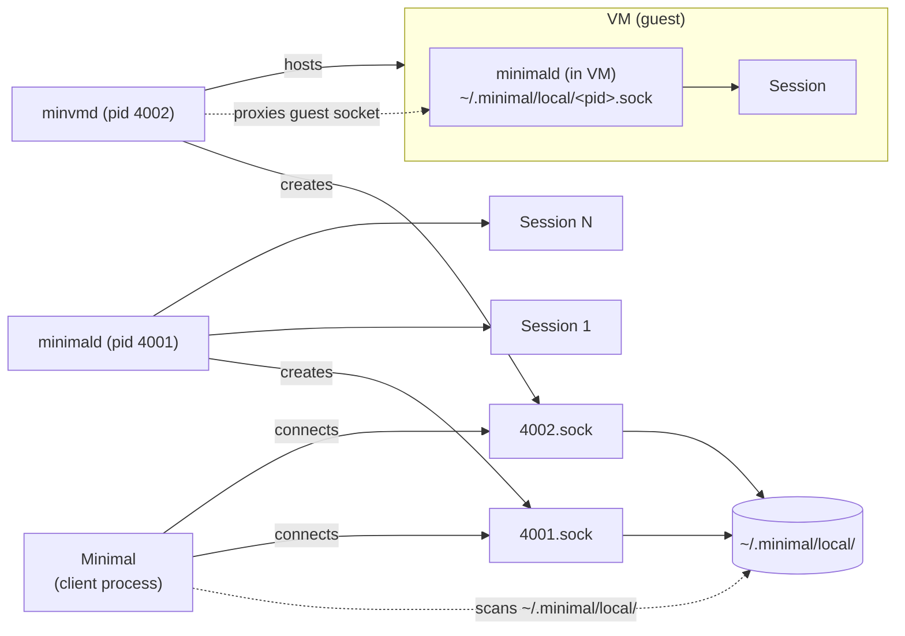
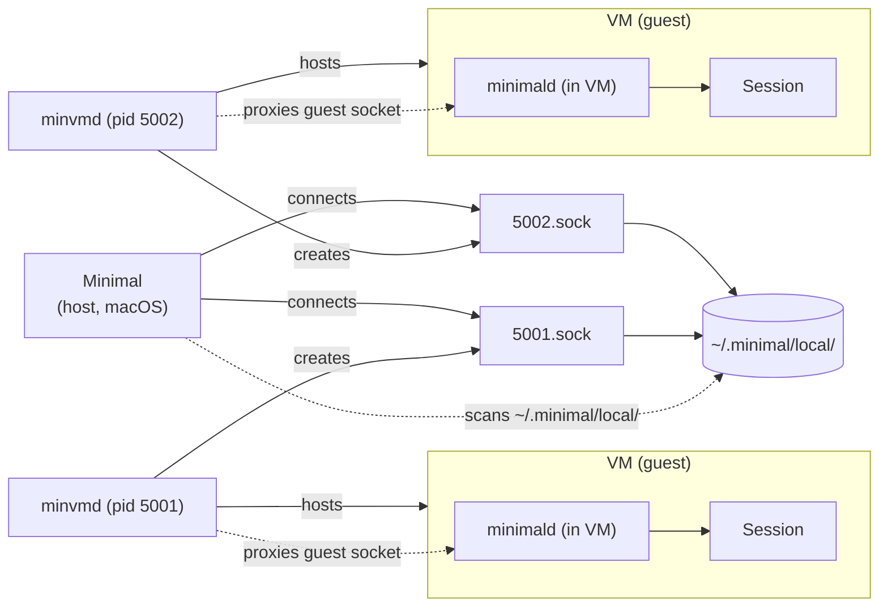
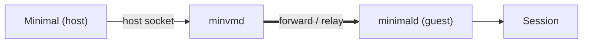
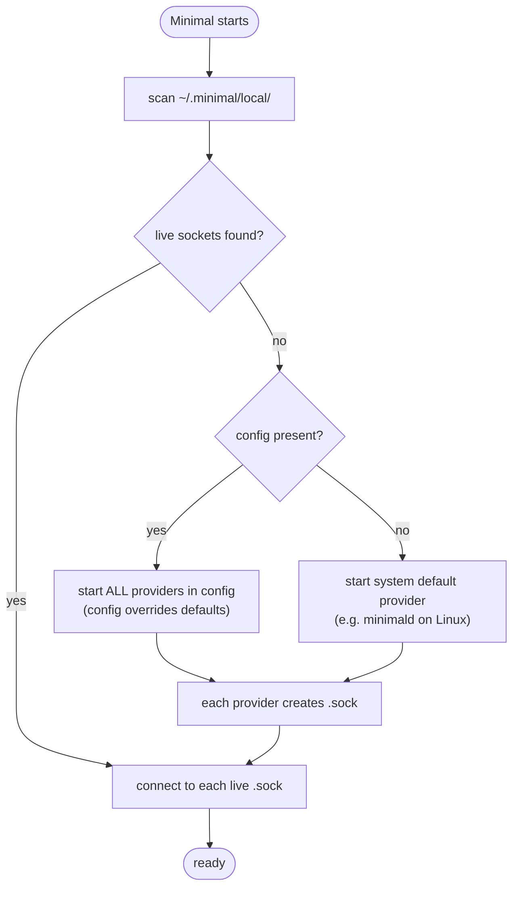

# Session Domain Model

> Vernacular: the isolation environment is a **Session**. The thing that creates and hosts them is a **Provider**.

## Main diagram

## Local Linux deployment

## Local macOS deployment

macOS has no native `minimald` (it is a Linux provider), so `Minimal` **cannot talk to a `minimald` directly**. All sessions are reached through a VM. `Minimal` may run **multiple `minvmd`s**, each hosting a VM that runs an in-VM `minimald` whose socket is proxied back to the host.

- No direct `minimald` on macOS; isolation requires a Linux VM.
- Multiple `minvmd`s are allowed, each a separate provider with its own host socket.
- The host never sees the guest `minimald` except through the `minvmd` proxy.

## VM socket proxying

- The in-VM `minimald` creates its own `~/.minimal/local/<pid>.sock` inside the guest.
- `minvmd` **proxies/forwards** that guest socket back to the host, so host `Minimal` talks to the in-VM `minimald` through `minvmd`.
- `Minimal` connects to `minvmd`'s host socket; `minvmd` relays traffic across the VM boundary to each VM's `minimald`.

## Socket lifecycle

- **Providers own the socket lifecycle**: create `~/.minimal/local/<pid>.sock` on start, remove it on shutdown.
- One socket per provider process; PID namespaces the socket file.
- `Minimal` discovers providers by scanning `~/.minimal/local/` and connecting to each `<pid>.sock`.
- `Minimal` must **detect dead providers**: a `<pid>.sock` may be stale (provider crashed without cleanup). Connect-and-prune or liveness-check on discovery.

## Startup / bootstrap

**Bootstrap rules:**
- No config → start the single system-default provider for the OS.
- Config present → start **all** providers listed; config fully overrides defaults.
- A spawned provider creates its `<pid>.sock`, then `Minimal` connects.
- Stale `<pid>.sock` files (dead provider) are skipped/pruned during the scan.

## Glossary

| Term | Meaning |
|------|---------|
| Session | The isolation environment. |
| Provider | Creates and hosts sessions; exposes a socket. |
| minimald | Linux provider — hosts sessions directly. Also runs inside a VM. |
| minvmd | VM provider — hosts VMs; each VM runs a minimald and minvmd proxies its socket to the host. |
| minhosted | Hosted provider — hosts sessions on an externally managed backend. |
| mincloud | Cloud provider — hosts sessions on a cloud backend. |

> Note: `minhosted` and `mincloud` are placeholders. They could be specialized into neocloud or hyperscaler-specific backends (e.g. a per-provider daemon for a specific neocloud, or AWS/GCP/Azure).
| Minimal | Client process; discovers providers via sockets, starts a default/config provider when none exist. |
