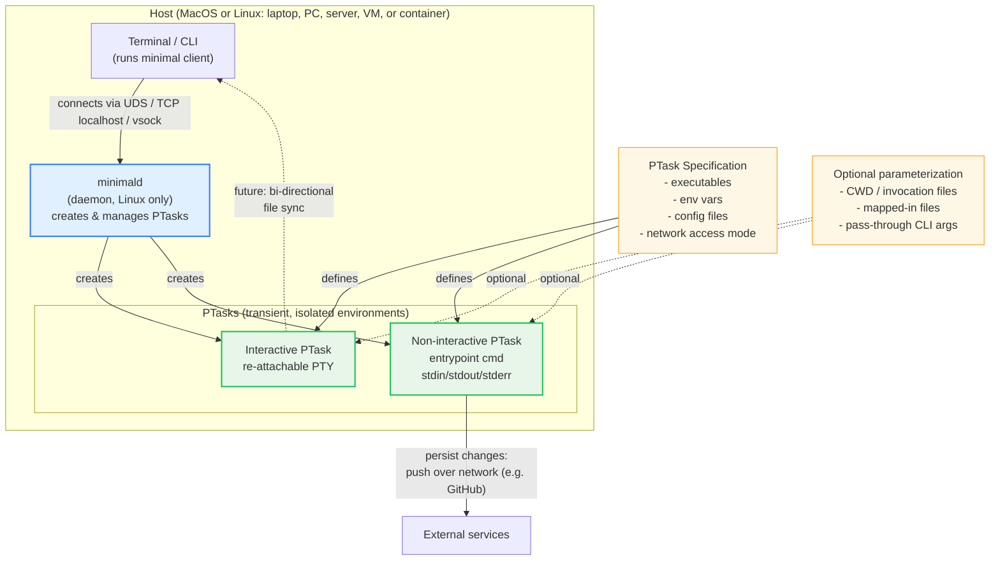
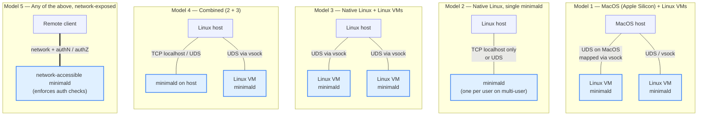
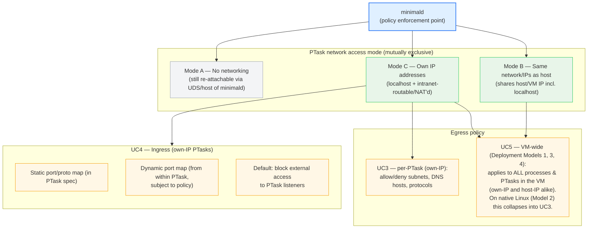
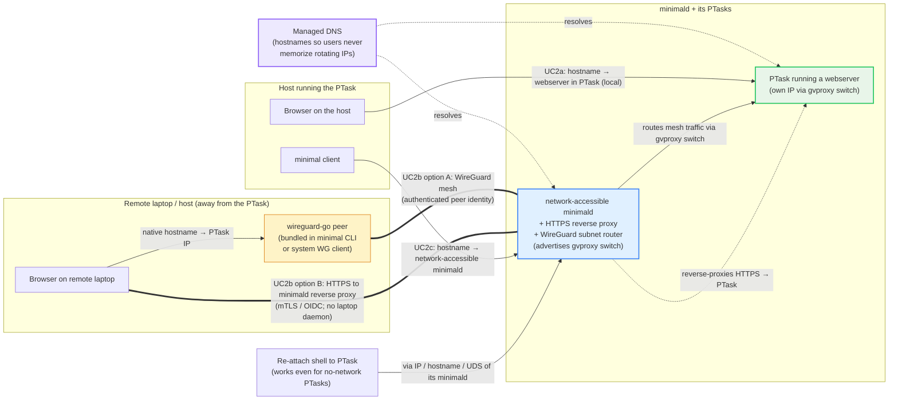
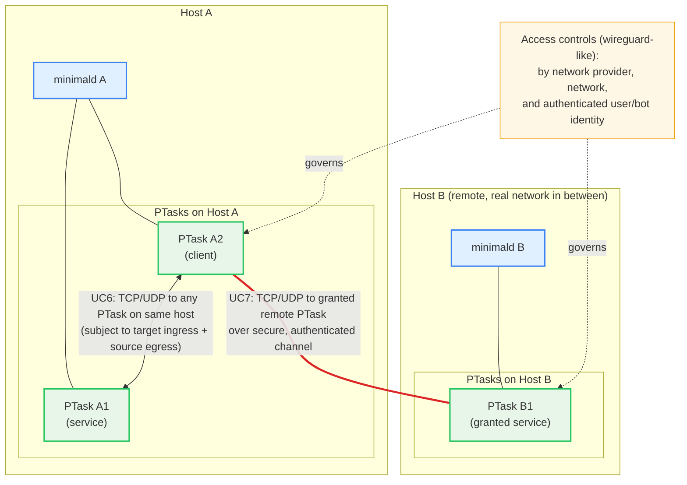
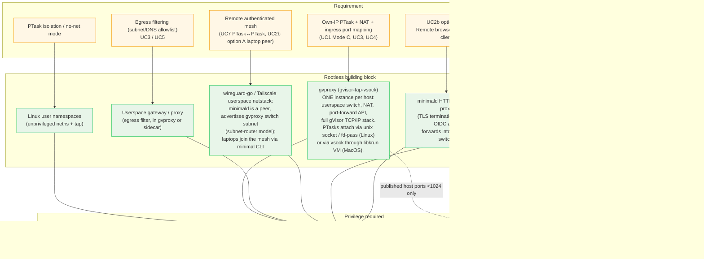
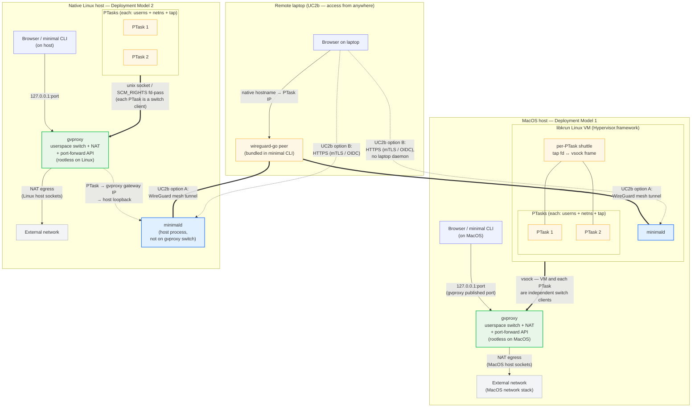

# Networking in Minimal — Spec with Diagrams

This specification outlines the networking use cases for the Minimal "minimald" tool.

The is some exploration of implementation options that do not require the user
to have root privileges. This does not exclude other implementation approaches or
additions such as enabling SSH port-forwarding (communications with the minimald are over SSH).

The final three sections add the implementation analysis: diagram 6 maps each
requirement to a no-root building block; diagram 7 shows the resulting network
topology; and a "UC2b — Remote browser access" section elaborates the two
implementation paths for "browser on my laptop → service in a remote PTask."

The implementation choices are **libkrun** for MacOS Linux VMs, **one gvproxy
per host** serving all PTasks as switch clients (over `unix socket` on native
Linux, over `vsock` through the libkrun VM on MacOS), a **WireGuard mesh** with
minimald as a subnet-router peer for UC7 PTask↔PTask remote and UC2b option A
laptop access, and an **HTTPS reverse proxy on minimald** (mTLS / OIDC) for the
no-laptop-daemon UC2b option B.

---

# Domain Model

*Host* - a Developer Laptop, PC, Linux server, Linux VM, or Linux
Container where the user has access to a terminal/CLI to run Minimal
software.  The OS can be MacOS and Linux.

*PTask* (place holder, "primordial task") - a transient (e.g. minutes,
hours, days, weeks, months), Minimal-created, isolated environment
that has exactly the executables, env vars, configuration files and
network access specified by the PTask Specification. It may optionally
be "parameterized" by files from the invocation directory/CWD,
mapped-in files and additional, passed-through CLI arguments.  A PTask
may be interactive (Minimal-provided, re-attachable, terminal/PTY
access for humans), or non-interactive (dedicated running processes,
no Minimal-provided PTYs, defined by the entry point command).  For
non-interactive tasks, stdin can be considered an input, and stdout
and stderr can be considered outputs (all optional). PTask Network
access may be none, restricted by a Minimal Network Policy, and full.
If it has network access it may be use the network namespace of its
host or have its own IP address.

In the future there may be bi-directional file synchronization options
between the invocation environment and the PTask. Interactive PTasks
could even support file synchronization to the re-attaching
environment, which might be different than the original invocation
environment. Until then, it is assumed that file changes the user
wants to be kept after the PTask is terminated will be pushed out over
the network (e.g. to github).

*minimald* is a software daemon that runs on Linux and can create
PTasks on that host.

# Roles

Developer - works with shells, compilers, editors, agents and other
tools to build software. Has some understanding of networking.

Agent User in a Terminal. Can use a CLI but may have very limited
understanding of networking and shells.

SecOPs/SRE - keeps the development and IT processes secure, and
ensures the available policy configuration options are set to provide
the best balance of security and productivity while meeting
compliance requirements.

For access to the host's network(s) the PTask's processes do not have
to appear to be identical to those of the host (e.g. the PTask could DHCP or be
assigned its own IP) or it can have a private/test/internal IP that is
NAT'd to that of the host, provided all the access modes specified
below work.  What we choose will be based on the implementation with
the best ergonomics.

# Deployment Models to be Supported

1. MacOS with Apple Silicon with one or more Linux VMs, each with a
   minimald running in them, where each is accessible by a SOCK_STREAM
   Unix Domain Socket on MacOS (mapped through a vsock into the VM)

2. Native Linux (headless or GUI) with one minimald on that host that
   is TCP accessible only on localhost or UDS (multi-user linux may
   have one minimald per user)

3. Native Linux (user headless or GUI) with one or more Linux VM each
   with its own minimald that is accessible by a SOCK_STREAM Unix
   Domain Socket (mapped through a vsock into the VM)

4. 2 & 3 combined (ie one or more user is running minimal on the main
   host and one more user is running minimal in one or more VM)

5. Any of the above where one or more minimald is accessible over the
   network and enforces authentication and authorization checks

> On MacOS, the Linux VMs in Model 1 are run by **libkrun** on
> Hypervisor.framework. VM ↔ MacOS-host networking is provided by
> **gvproxy** over vsock (see the implementation analysis at the end of
> this document).

# Use Cases/Requirements

1. Developers should be able to configure whether a ptask
- uses the same network/IPs (including localhost) as its immediate linux host
- xor has its own IP addresses (localhost and an intranet-routable one (test/doc network or private))
- xor has no networking

2. Developers should not have to remember IP addresses, especially if they change/rotate, so DNS should be updated to provide hostnames that offer access to
- the minimald(s) that are configured to be network accessible
- the network services running in ptasks in the cases where the ptask has its own IP or uses its linux host's IP

key use cases:
- I can access a webserver in a ptask by using its hostname in browser on the host on which the ptask is running.
- I can access a webserver in a ptask by using its hostname in browser on a host remote from the ptask over a secure, authenticated channel
- I can access a network-accessible minimald using its hostname with my minimal client

Note that interactive ptasks with no networking are still accessible by a shell (re-attach) by accessing the IP, hostname or UDS of the associated minimald.

3. if a ptask has its own IP address, it should be possible to
   configure what IP subnets, DNS hosts, optionally protocols over IP
   it may access. [ should configuring these for ptasks that use the
   VM or host IP vs having their own be considered an error or should
   they be rolled into the VM/host egress configuration - see #5]

key use cases:
- deny ptasks from accessing internal subnets (e.g. typically private IP subnets like 10/8 etc)
- allow list specific dns hosts (e.g. github.com) or IP addresses

4. If a ptask has its own IP address, it should be possible to
   configure whether it allows no, some or full network ingress by
   specifying ports and protocols.  It should be possible to
   statically configure these mappings with the ptask spec. It should
   be possible to dynamically configure port mappings from within the
   ptask itself, subject to policy in the ptask-spec or elsewhere

key use cases:
- prevent programs listening on the ptask's IP from being accessed
  from outside of the ptask
- allow specific ports to be accessed, statically or dynamically
  (e.g. access a freshly vibed up webserver and want to stay in the
  flow in the interactive ptask)

5. As developer running PTasks in a VM I want to control egress access
   for the VM much like #3's per-ptask egress controls except this
   configuration applies to all processes and PTasks running in the VM
   (both those with IP address and those using the VM's IP)

key use cases:
- prevent ptasks that use the VM's IP from accessing network services that they should not

## UC1, UC3, UC4, UC5 — PTask network modes, egress, ingress

## UC2 — Hostnames / DNS and the three access flows

6. As a Developer I want processes running in a PTask to be able to
   access by TCP and UDP any other services running in PTasks on the
   same host, subject to target PTasks' ingress restrictions and the
   source ptask's egress restrictions.

7. As a Developer I want processes running in a PTask to be able to
   access by TCP and UDP any other services running in PTasks it has
   been granted access to, on any remote server. A secure,
   authenticated channel must be used when transiting real
   networks. It should be as simple as possible to configure these
   remote service access controls - e.g. by network provider, network
   work, and authenticated user/bot identity (like wireguard)

## UC6 & UC7 — PTask-to-PTask connectivity (local and remote)

---

# Rootless Implementation Analysis (overlay)

This section is not part of the spec — it is the implementation analysis
that maps each requirement to a no-root building block.

**VMM:** Linux VMs (Deployment Models 1, 3, 4) are run by **libkrun** — on
Hypervisor.framework on MacOS, on KVM on Linux. The MacOS path is fully rootless
once Hypervisor.framework entitlement is granted to a self-signed binary.

**One gvproxy per host serves all PTasks as switch clients.** A single
gvproxy (gvisor-tap-vsock) instance runs on each host. It provides:
- the userspace switch on which PTasks (and, on MacOS, the libkrun VM itself)
  appear as peers — covering UC1 Mode C own-IPs and UC6 same-host PTask↔PTask;
- the NAT + egress for UC3/UC5 (with the option of a sidecar filter for the
  allowlist policy);
- the port-forward API for UC4 ingress.

PTasks attach to the gvproxy switch over a `unix socket` (or `SCM_RIGHTS`
fd-pass) on native Linux, and over `vsock` (with a small per-PTask shuttle
process inside the VM) on MacOS. The two cases are architecturally the same
picture minus the VM/vsock layer (see diagram 7).

**Why not pasta for the per-PTask layer?** pasta would work and is the
podman-rootless default at that layer, but:
- it cannot run on MacOS, so the MacOS path would need a *second* userspace
  stack (gvproxy) anyway — two TCP/IP implementations to trust and debug;
- pasta does TCP splicing rather than running a full TCP/IP stack, which is
  more fragile under unusual flows and L4 edge cases;
- gvproxy's full gVisor `tcpip` stack handles arbitrary L3/L4 by construction.

Choosing gvproxy for both layers gives us **one TCP/IP implementation to reason
about, debug, and trust** across MacOS and Linux. The price is per-PTask CPU
overhead vs pasta; acceptable for a developer-workstation workload.

**UC5 on native Linux:** with no VM there is no VM-wide scope to defend, so
UC5 collapses into UC3 (per-PTask egress) on Deployment Model 2.

# Network Topology (Shape 2)

The picture that falls out of the choices above: one gvproxy per host, all
PTasks (and on MacOS the libkrun VM itself) as clients on its switch.

- **PTask ↔ PTask** on the same gvproxy switch is direct — one userspace hop,
  no kernel routing. On MacOS that hop round-trips out of the VM via vsock; on
  native Linux it stays in one process.
- **Host → PTask** is via published ports on `127.0.0.1:port` (no host-side tap
  needed, so no host `CAP_NET_ADMIN`). UC2a (browser → PTask by hostname) works
  by resolving the hostname to a published port; UC2b (remote browser) goes
  over the UC7 authenticated channel.
- **PTask → minimald**: on MacOS, minimald is a switch peer inside the VM — a
  direct hop on the switch. On native Linux, minimald lives on the host
  network (not on the switch); PTask traffic to it exits via gvproxy's
  gateway IP into the host's loopback.
- **Egress** is a single NAT through gvproxy to the host network — one
  TCP/IP stack in the path on either platform.

# UC2b — Remote browser access (implementation notes)

UC2 is in the spec; UC2b specifically — "I can access a webserver in a ptask by
using its hostname in a browser on a host remote from the ptask over a secure,
authenticated channel" — is the path that needs the most implementation
elaboration, because the laptop is not running PTask code and so cannot itself
be a UC7 mesh participant by virtue of running a PTask. minimald speaks SSH
(`russh`), so SSH port-forwarding is technically available, but it reintroduces
the manual `localhost:port` UX that UC2 was written to avoid (hostname-driven
access, no memorized ports). The two paths below preserve the hostname UX.

Note that there are interesting options like embedded an egress webproxy in the
gvproxy and using PAC file with MacOS's webproxy configuration to make it
work with the DNS hosts minimal creates for PTasks and VMs.

## Option A — Laptop joins the WireGuard mesh

The same mesh substrate that carries UC7 (PTask↔PTask remote) carries UC2b.
- Each minimald is a wireguard-go peer and advertises its gvproxy switch
  subnet (Tailscale-style subnet router). PTask IPs are therefore routable
  across the mesh to any authorized peer.
- The laptop becomes a peer via `minimal CLI` — wireguard-go is bundled, no
  system installer needed beyond first run. On platforms with a first-party
  WireGuard app that can also be used.
- DNS resolves PTask hostnames to PTask switch IPs (the same `*.minimald-host`
  names already used locally). The browser hits the hostname directly; the
  request flows: laptop → WG tunnel → minimald → gvproxy switch → PTask.
- Auth is by mesh peer identity, enforced at minimald (which is the policy
  enforcement point and the routing peer). The same access-control surface
  governs UC2b option A and UC7.
- Works for any L4 traffic (TCP, UDP, WebSockets, raw protocols) — not just
  HTTP — because it is real IP routing.

**When to prefer:** daily-use access from a known laptop; CLIs and tools that
need raw TCP/UDP; situations where running a small mesh client is acceptable.

## Option B — HTTPS reverse proxy on minimald (mTLS / OIDC)

For "I just want to open this in a browser, no client install":
- minimald terminates TLS on a real hostname (managed CA cert, or ACME if
  minimald has a public DNS name).
- Authentication is either an **mTLS client cert** (issued by `minimal login`
  for the laptop's identity, stored in the OS keychain) or an **OIDC redirect**
  flow (browser bounces through the org's IdP and gets a session cookie).
- After auth, minimald reverse-proxies the request into its gvproxy switch to
  the target PTask, using the same hostname-routing already used by UC2a.
- Same policy plane as option A (per-PTask ingress permissions checked at
  minimald), just a different transport.

**Constraints / when to prefer:** HTTPS / WebSockets only — no raw TCP/UDP.
Useful when WireGuard is blocked by the network, or when a teammate without a
mesh client needs to open a URL ad-hoc.

## How this changes the diagrams

- **Diagram 4 (DNS / access flows)** now shows UC2b as the two distinct paths
  (mesh and reverse proxy), with the laptop drawn explicitly.
- **Diagram 6 (rootless building blocks)** extends `R6 / B6` to cover UC2b
  option A (wireguard-go runs on the laptop too, minimald is the subnet
  router), and adds `R8 / B8` for the minimald HTTPS reverse proxy used by
  option B.
- **Diagram 7 (topology)** adds a "Remote laptop" subgraph above the two host
  panels, with `===` mesh tunnels (option A) and `-..->` HTTPS arrows (option
  B) to either host's minimald.

## Why not SSH port-forwarding as the primary

It would work — russh in minimald already authenticates and encrypts — but the
UX gives up the hostname-driven access that UC2 was designed around: each PTask
service becomes a separately-managed `ssh -L` tunnel mapped to a `localhost:N`
the user has to remember (or that a helper has to manage). Layered on top of a
local resolver / proxy you could rebuild the hostname UX, but at that point you
are re-implementing option A's UX with more moving parts and a transport that
cannot carry UDP. SSH-forward is best kept as a fallback for restricted
networks where WireGuard cannot get out.

