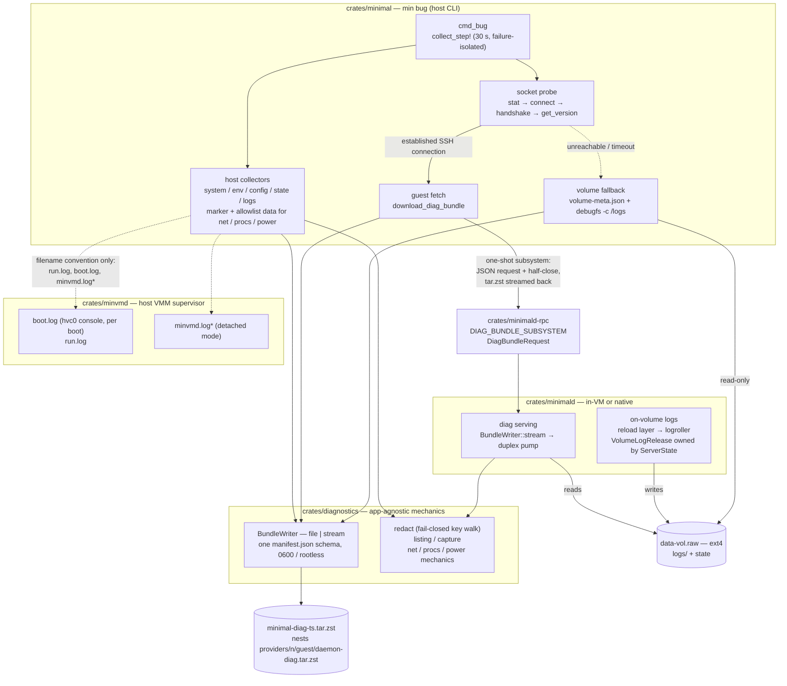
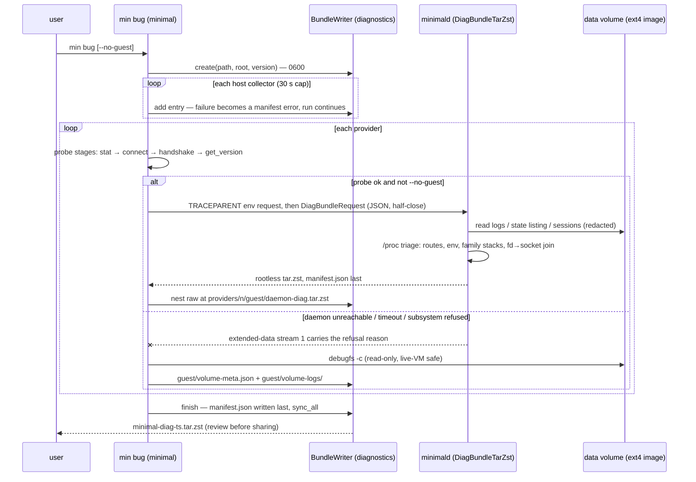
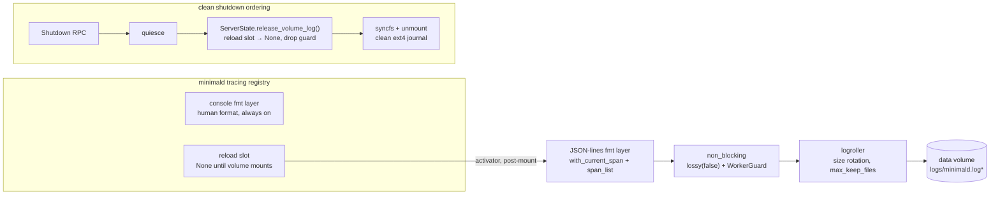
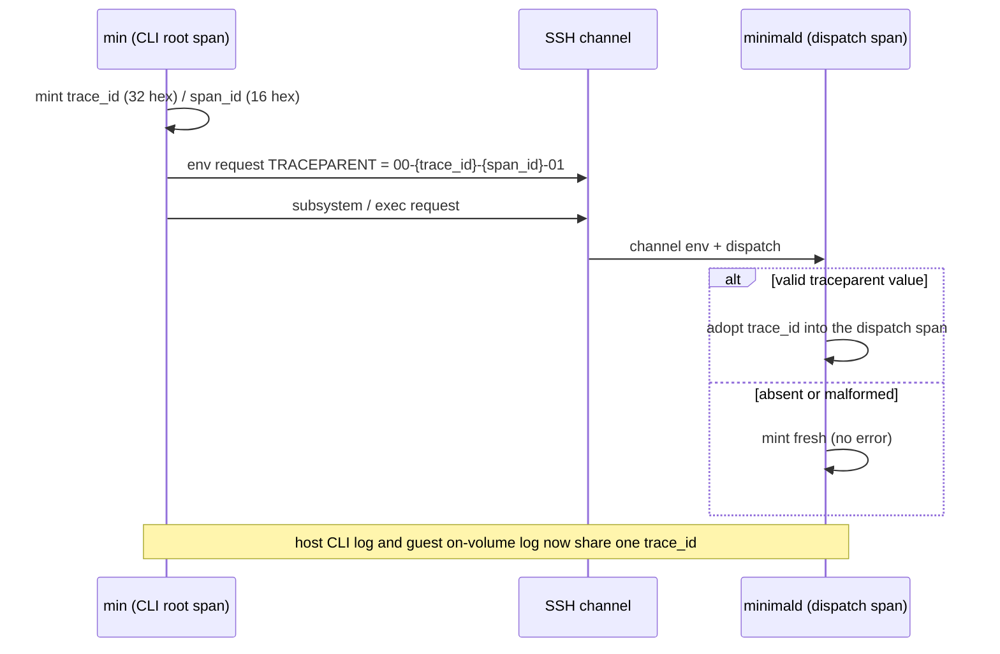

# Diagnostics subsystem — architecture

## Chosen approach

A four-crate change plus one new crate. **`diagnostics`** (new) owns every
app-agnostic mechanic: the bundle writer (file-backed for the CLI, streaming
for the daemon, one manifest schema for both), the fail-closed key-based
redaction engine, metadata-only listings, subprocess capture, and — by series
end — the net/procs/power collector mechanics parameterized by caller data.
**`minimal`** owns only what is specific to the `bug` command: clap surface,
path/config resolution, the marker and allowlist *data*, provider discovery,
the socket probe, and the guest fetch. **`minimald`** serves its own bundle
over a one-shot SSH subsystem (`DiagBundleTarZst`, contract in
**`minimald-rpc`**) and persists its logs onto the data volume behind a
reload-swappable layer whose release is owned by `ServerState`. **`minvmd`**
persists detached-mode logs and defaults the VMM console into
`<provider>/boot.log`.

The collection path assumes nothing is alive. The host bundle is complete
without any daemon; per provider, a staged socket probe records exactly where
contact breaks; the daemon bundle is one tar.zst blob over an
already-established connection; and when the daemon or transport is the
suspect, the CLI reads the guest's log tree straight out of the ext4 volume
image with `debugfs -c`. Correlation rides tracing spans and OTEL-shaped
ids/field names (no OTEL dependency), so host and guest records join on a
`trace_id` grep.

The work re-lands from the reference branch `min-bug-diagnostics`
(head `77fc711e` — PR #784 with all review findings addressed) as eight
serial units, each an independently mergeable PR under 1000 lines. Baselines
below cite the reference tree as `ref:`.

## System view

Crate boundaries and the paths a bundle takes — including the degraded path,
which is the design center:



A full `min bug` run, including the degraded branch:



The in-VM log pipeline and the release ordering that keeps the volume's
unmount clean:



Trace propagation across the CLI→daemon boundary (Unit 4):



## Data and interface changes

### `crates/diagnostics` (new)

```rust
// bundle.rs
pub struct BundleWriter<W: AsyncWrite + Unpin + Send + Sync = tokio::fs::File> { .. }

impl BundleWriter<tokio::fs::File> {
    /// File-backed, 0600 before content, entries prefixed `{root}/`.
    pub async fn create(out_path: &Path, root: &str, version: &str) -> Result<Self>;
}
impl<W: AsyncWrite + Unpin + Send + Sync> BundleWriter<W> {
    /// Streaming, rootless (entries at archive top level).
    pub fn stream(writer: W, version: &str) -> Self;

    pub async fn add_bytes(&mut self, path: &str, bytes: &[u8], redaction: Redaction) -> Result<()>;
    pub async fn add_file_tail(&mut self, path: &str, src: &Path, cap: u64) -> Result<()>;
    pub fn skip(&mut self, what: &str, reason: &str);
    pub fn error(&mut self, collector: String, error: String, took: Duration);
    /// Writes manifest.json last, then finalizes (file: flush + sync_all;
    /// stream: flush + shutdown) via a sealed finalize strategy.
    pub async fn finish(self, created_at: DateTime<Utc>, took: Duration) -> Result<()>;
}

// capture.rs (new module)
pub async fn command_capture(cmd: &str, args: &[&str], timeout: Duration) -> Result<Capture>;
// kill_on_drop(true); stdout + stderr + exit status; timeout → typed error.

// redact.rs — key-based policy engine (shared verbatim by CLI and daemon)
pub fn is_sensitive_key(key: &str) -> bool;      // compound public_key handling
pub fn is_env_table_name(name: &str) -> bool;
pub fn redaction_placeholder(original: &Value) -> Value;   // <redacted:len=N>
pub fn redact_json(value: &mut Value);           // recursive, fail-closed

// listing.rs — structured so failure is distinguishable from emptiness
pub fn listing(root: &Path, max_entries: usize) -> Result<Listing>;
// names/sizes/kinds only; Err on unreadable root (caller records a manifest
// error); per-entry failures recorded inline; cap hit appends an explicit
// trailing truncation marker line.
```

Crate root curates the surface (`pub use` of `BundleWriter`, `Redaction`,
`LOG_TAIL_CAP`, `capture::{command_capture, Capture}`, manifest types);
`Manifest`/`CollectedEntry`/`SkippedEntry`/`CollectorError`/`Redaction` are
`#[non_exhaustive]`. Unit 5 adds
`net`/`procs`/`power`/`collect` modules whose signatures take caller data:

```rust
// procs.rs — markers are DATA supplied by the app, mechanics live here
pub async fn process_tree<W: ..>(w: &mut BundleWriter<W>, markers: &[&str]) -> Result<()>;
pub async fn hang_triage<W: ..>(w: &mut BundleWriter<W>, markers: &[&str]) -> Result<()>;
// net.rs: listening_sockets / interfaces (MAC→OUI) / routes
// power.rs: power (pmset | journalctl, event-capped)
// collect.rs: disk_info (statvfs), rotated_logs (newest-N by prefix, tail-capped),
//             env(allowlist: impl Fn(&str) -> bool)
```

ref: crate exists at `crates/diagnostics/src/{bundle,manifest,redact,listing}.rs`
(file-only writer). ALREADY EXISTS: the manifest schema, redaction engine
with compound-key regressions, `take(cap)` read bounding and an
lstat-then-open symlink guard — `bundle.rs:92-133`, `redact.rs:36-90`; Unit 1
upgrades the guard to a no-follow open (R1.4, TOCTOU-safe).

### `crates/minimal` — `min bug` (`src/diag/`)

```rust
// mod.rs
pub struct BugArgs { output: Option<PathBuf>, no_guest: bool /* Unit 7 */,
                     guest_timeout_secs: u64 /* Unit 7 */ }
pub async fn cmd_bug(global: &GlobalArgs, args: BugArgs) -> Result<()>;
macro_rules! collect_step { .. }   // 30 s timeout; error → manifest, run continues
```

Collector wiring is explicit `collect_step!` invocations — deferring a
collector to a later unit is deleting its invocation line, leaving no dead
code. `diag/redact.rs` holds the CLI-only adapters over the shared engine:
`redact_toml` (the daemon never reads TOML) and the env allowlist data.
`dirs.rs` refactors `report()` to return `String` (sole caller `cmd_dirs`
unchanged in behavior — ref `dirs.rs:37`).

Unit 7 adds the guest surface:

```rust
// net.rs (probe half)
pub struct SocketProbe { stages: Vec<Stage> }   // stat → connect → handshake → get_version
pub async fn probe_socket(sock: &Path) -> (SocketProbe, Option<Client>);
// the Option<Client> hands the established connection to the download — no second handshake

// client.rs
pub async fn download_diag_bundle(&mut self, req: &DiagBundleRequest, max_bytes: usize)
    -> Result<Vec<u8>, DownloadError>;   // extended-data stream 1 → daemon_error (64 KiB cap)

// guest.rs
pub async fn collect(..) -> Result<()>;          // nest raw daemon-diag.tar.zst per provider
// verification of the downloaded blob is a bounded STREAMING decode (R7.3):
// decompressed ≤ 4× compressed, 1 GiB ceiling, ≤ 10k entries — never full
// materialization of the decompressed stream.
pub async fn volume_fallback(..) -> Result<()>;  // volume-meta.json + debugfs -c /logs harvest
```

ALREADY EXISTS: `Client::connect` / `oneshot_rpc::<GetVersion>` —
`crates/minimal/src/client.rs:118` (main); `paths::SSH_SOCK_FILE`;
`minvmd::state::StateDir` liveness probes — `crates/minvmd/src/state.rs:133,193,200` (main).

### `crates/minimald-rpc` — wire contract (Unit 6)

```rust
pub const DIAG_BUNDLE_SUBSYSTEM: &str = "minimald-v1-DiagBundleTarZst"; // never renamed

#[non_exhaustive]
#[derive(Debug, Clone, Serialize, Deserialize, PartialEq, Eq)]
pub struct DiagBundleRequest {
    #[serde(default)]
    pub log_tail_bytes: u64,          // 0 = daemon default; clamped server-side
    #[serde(default = "default_true")]
    pub include_state_listing: bool,  // default true
}
// A bare `{}` decodes to the documented defaults (R6.1 empty-request test).
// Client writes one JSON request + half-close; daemon streams tar.zst and closes.
// Pre-stream errors relay on extended-data stream 1 (zero payload bytes ⇒ read it).
```

ALREADY EXISTS: the oneshot/subsystem RPC plumbing and
`RPC_SUBSYSTEM_PREFIX` — `crates/minimald-rpc/src/lib.rs` (main).

### `crates/minimald` — serving + on-volume logs

```rust
// diag.rs (Unit 6) — rebuilt on BundleWriter::stream (rootless)
// duplex pump stays: russh channel writer is !Sync, async_tar::Builder needs Sync
let (tx, rx) = tokio::io::duplex(64 * 1024);
let mut w = BundleWriter::stream(ZstdEncoder::new(tx), version);
// collect: meta.json, logs/ (tail-capped, no-follow opens), state-listing.txt
// (spawn_blocking), sessions/ (redact_json, per-record error files), proc.txt
// (full argv only for diagnostics::procs marker matches, else comm),
// net/ (raw /proc/net tables + routes.txt: route + fib_trie), env.json
// (allowlist + sensitive-key policy), proc/<pid>.stack.txt +
// proc/sockets.txt (in-VM hang triage: wchan/stacks/fd readlinks and the
// fd→socket-inode join — pure /proc, no lsof/ss/ip in the microVM rootfs),
// disk.json → finish() writes manifest.json
// errors.json is RETIRED — both bundle layers carry manifest.json.

// server.rs (Unit 3)
pub struct VolumeLogRelease(pub Box<dyn FnOnce() + Send>);
impl ServerStateHandle {
    pub async fn release_volume_log(&self);   // take + invoke, at-most-once
}
// main.rs (Unit 3): reload-layer activation after volume mount
let (file_layer, reload) = tracing_subscriber::reload::Layer::new(None);
// activator: build logroller appender → non_blocking (lossy(false)) →
// reload.modify(Some(json_fmt_layer)) ; release: reload.modify(None) + drop(guard)
```

ALREADY EXISTS: the Shutdown→quiesce path that triggers the release —
`crates/minimald/src/rpc.rs:346` (main), invoked from the Shutdown handler at
`rpc.rs:319` (main). ALREADY EXISTS: test harness `open_subsystem`/
`create_configured_session` — `crates/minimald/src/test_harness.rs:245,419`
(main). ref: the reload/release design is proven at
`minimald/src/{main.rs:391-434,server.rs:103-118}`; Unit 3 re-lands it with
logroller as the writer and JSON-lines arriving in Unit 4.

### `crates/minvmd` — detached logs + boot.log (Unit 3)

- `cmd/run.rs`: detach re-exec sets `DETACHED_ENV` (mirrors the pre-existing
  `MINIMALD_DETACHED` pattern); `main.rs` `init_tracing` adds a rolling file
  layer only when the marker is present.
- `cmd/vmm_child.rs`: console capture defaults to `<provider dir>/boot.log`
  (truncate per boot; `MINVMD_BOOT_LOG` overrides; failure warns and boots
  on). `justfile` and `scripts/session-e2e.sh` drop their manual
  `MINVMD_BOOT_LOG` exports **in the same PR** — removing the exports before
  the default exists would silently discard the console in dev flows.

ALREADY EXISTS: `state::provider_dir()` / `state_base_dir()` —
`crates/minvmd/src/state.rs:54,63` (main). Coupling to `min bug` is
filename-convention only (`run.log`, `boot.log` literals in the collector) —
no code import in either direction.

### Trace propagation (Unit 4)

The CLI mints `trace_id` (32 hex) / `span_id` (16 hex) at command dispatch
and sends an **SSH channel env request** named exactly `TRACEPARENT` — one
shared constant on both ends; SSH env names are byte-exact — carrying the
W3C traceparent-format value (`00-{trace_id}-{span_id}-01`), before
subsystem/exec invocation — out-of-band, no RPC envelope change,
unknown-env-tolerant on old daemons. The daemon validates and adopts
the trace id into its dispatch span; malformed/absent mints fresh. File logs
switch to `fmt::layer().json().with_current_span(true).with_span_list(true)`;
console layers stay human-format. Resource identity (`service.name`,
`service.version`, `service.instance.id`, `host.name`, `process.pid`) lives
on each process's root span using OTLP attribute names.

## Alternatives considered

**System-info crates for collection (`sysinfo`, `procfs`, `bugreport`,
`netstat2`, `os_info`).** Rejected: typed scrapers re-serialize (parser
version-skew silently drops fields; parse failure becomes collection
failure), while the bundle's deliverable is the raw bytes; failure isolation
is trivial over ten-line readers and hard over a library surface; the same
collectors run as microVM pid-1 in a size-sensitive initramfs. Survey of what
peer CLIs actually ship (git/starship/bat: text reports; rustup/cargo/uv:
nothing) confirms hand-rolled is the state of the art. `procfs` (already in
minimald's transitive graph via hakoniwa) and `nix::sys::statvfs` (feature
already enabled) are named follow-ups under #801, not foundations.

**Redaction crates (`secrecy`, `veil`, `redact`, `redactable`, VRL).**
Rejected: all type-level (annotate your own structs) — the opposite shape
from walking user config you didn't define; `redactable` explicitly
wholesale-redacts dynamic values ("could contain anything") — i.e. the one
crate that considered the problem punted on it; VRL is a language runtime.
Nothing is fail-closed. The bespoke key-walk is ~200 lines no crate deletes.

**`tracing-appender` alone for rotation.** Rejected as the end state:
time-based only (tokio-rs/tracing#1940 open since 2022), so nothing caps
intra-day growth on a 32 GiB volume shared with user data. `flexi_logger`
(most featureful, but `log`-facade world, wants to own the subscriber),
`log4rs` (same, config-file culture), `rolling-file` (dormant since 2023)
rejected on ecosystem mismatch or maintenance. `logroller` adopted: plain
`io::Write` (composes with `non_blocking`/`WorkerGuard`/`reload` untouched),
size-based + retention + optional gzip. Reopen-trigger recorded in the spec.

**OpenTelemetry SDK / OTLP file exporter / collector in the guest.**
Rejected for the bundle path, in full: opentelemetry-rust is pre-1.0 with
traces still Beta and a breaking-upgrade treadmill across 4+ bridge crates;
opentelemetry-otlp's transitive footprint (~prost/tonic/tower/hyper, order of
100 crates) is real money in the initramfs; the OTLP file-exporter spec is
Development-status with no durability/rotation/flush semantics — the exact
properties a wedged process needs; SDK exporters buffer in memory and lose
the tail on a hang. Rust collectors (rotel) are resident services solving
telemetry forwarding, not post-mortem scraping — a component that must be
alive on the path that must work when nothing is. Adopted instead: the
conventions (Unit 4) that make later OTLP conversion a file transform on the
analysis machine.

**Streaming RPC for debug data.** Rejected: replaces a ~200-line one-shot
blob with protocol machinery whose failure modes are opaque exactly when the
transport is the suspect (#788's failure domain was the vsock transport
itself). The one-shot subsystem is served identically by native and in-VM
daemons and is preceded by a probe that already localizes transport faults.

**`BundleWriter` writing the russh channel directly.** Rejected:
`async_tar::Builder` requires `W: Sync`; the russh writer is not (`ref
minimald/src/diag.rs:57`). The duplex pump costs one `tokio::io::copy` task
and keeps the writer generic bound honest.

**Keeping the guest bundle's `errors.json`.** Rejected: two accounting
schemas for one concept, with the weaker one on the harder-to-debug side.
Nothing has shipped; converge on `manifest.json` now (Unit 6) and rework the
single out-of-tree consumer (Unit 8) rather than carry the split forever.

## Assumption ledger

| Slug | Statement | Bucket | Evidence / citation | Depends-on |
|------|-----------|--------|---------------------|------------|
| async-tar-sync | `async_tar::Builder` requires `W: Sync`; `DuplexStream`/`File` satisfy it, russh channel writer does not | settled | ref `minimald/src/diag.rs:57` comment + compile evidence on the reference branch | R1.2, R6.2 |
| quiesce-hook | The Shutdown→quiesce path that must invoke the log release pre-exists on main | settled | `crates/minimald/src/rpc.rs:319,346` (main) | R3.4 |
| default-type-param | `BundleWriter<W = File>` keeps `&mut BundleWriter` call sites compiling unchanged | settled | Rust default type parameters; verified against ~15 collector signatures on ref | R1.2 |
| logroller-fit | logroller composes under `tracing_appender::non_blocking` + reload as a plain `io::Write` | settled | logroller 0.1.12 API (io::Write); same shape as the appender it replaces | R3.6 |
| russh-env-request | Client can send an SSH channel env request and minimald's russh handler can surface it before subsystem dispatch | needs-spike | russh supports `env` channel requests; minimald's handler surface not yet desk-verified for env interception | R4.4 |
| debugfs-live-read | `debugfs -c` reads an ext4 image safely while a VM writes it | settled | exercised live during the #788 incident against `data-vol.raw`; harvest may be torn mid-write (acceptable) | R7.5 |
| rootless-guest-bundle | Consumers (nested verification, diag-explore) assume guest bundle entries at archive top level | settled | ref `minimald/src/diag.rs` (no root dir); diag-explore exact-key lookups | R1.2, R6.2, R8.3 |
| markers-basename | argv0-basename matching is sufficient to scope full-argv capture to the minimal process family | settled | ref `minimal/src/diag/procs.rs:14-32`, reviewed in #784 | R5.2, R6.2 |

The `russh-env-request` row blocks planning of R4.4 only: desk-verify during
Unit 4 design (read russh `ChannelMsg::Env`/handler plumbing both ends). If
interception is not possible without patching russh, the fallback is carrying
`traceparent` as an optional field on each subsystem's *request body* — an
**intentional additive wire-contract change** (compatible because request
bodies are `#[non_exhaustive]` with serde defaults), which amends R4.4's
no-wire-change clause and its acceptance criteria; record the deviation here
if taken.

## Knowledge gaps

- No contradictions with prior decisions: ADR-0001 (error strategy) is
  honored (`thiserror` in `diagnostics`, `anyhow` in apps); spec 08's
  quiesce/durability posture is strengthened, not contradicted, by the log
  release (R3.4) — the volume-log fd was the one remaining clean-unmount
  defeater on the reference branch.
- The reference branch's microVM release-before-quiesce path is
  compile/unit-verified only; the live re-validation is Unit 3's gating proof
  artifact (idle attach + `minvmd stop` → clean journal).
- Retention numbers (Open Question 3) have no measurement yet; Unit 3 records
  them back into the spec the way spec 08 recorded its sync-mode throughput
  data.
- The 09 spec slot is claimed by `09-spec-minvmd-resource-monitoring` on an
  unmerged branch (`d0441771`); this spec takes 10. If 09 is abandoned before
  this lands, renumbering is a mechanical rename.
- Prior work referenced but not in-tree: the #788 field bundle
  (`minimal-diag-20260716T203346Z.tar.zst`, attached to the issue) is the
  canonical pre-convergence sample for Unit 8's dual-format check.
